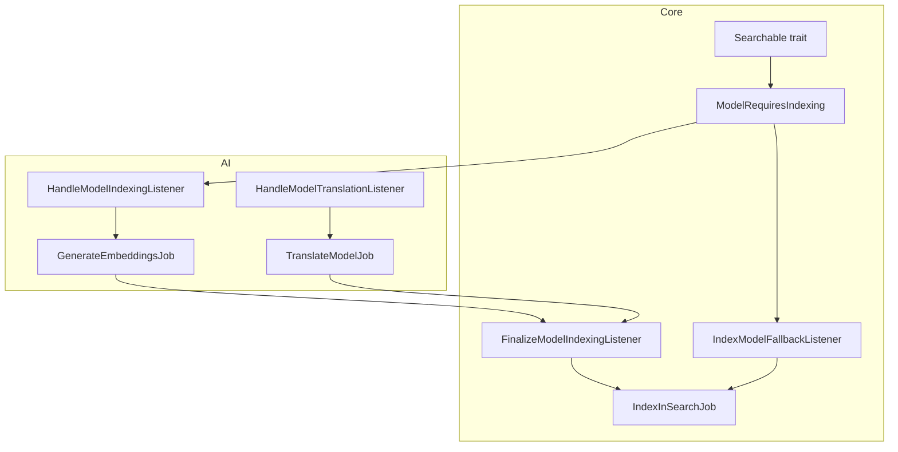
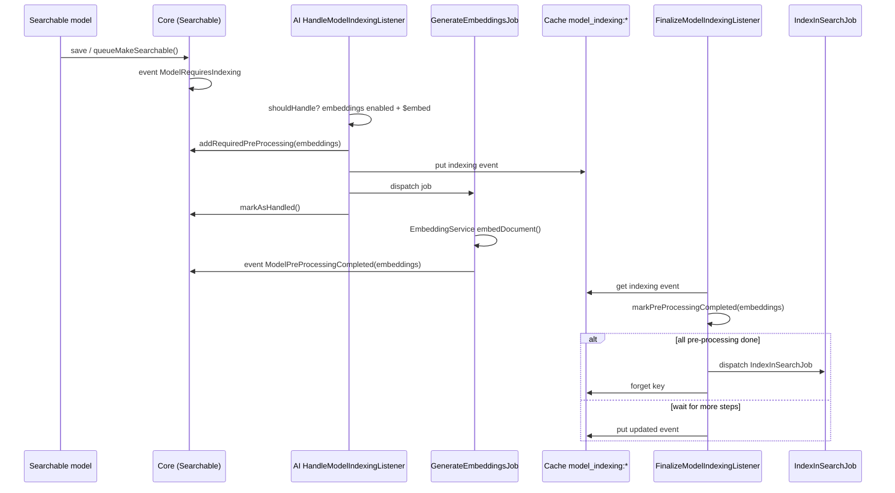
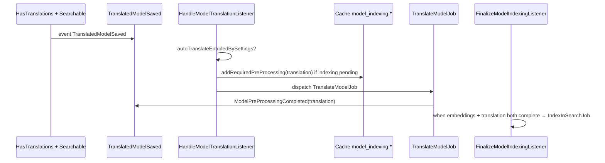
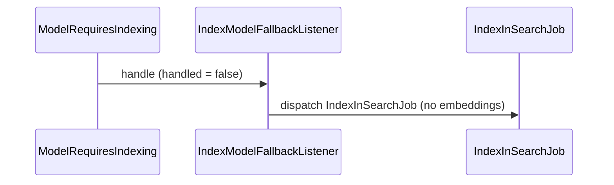
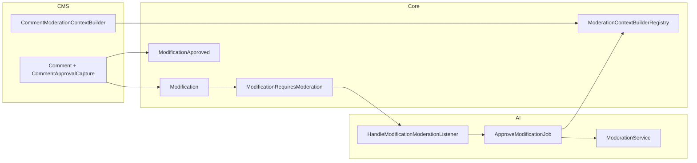
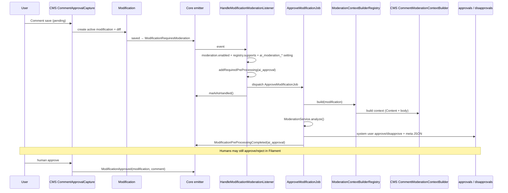
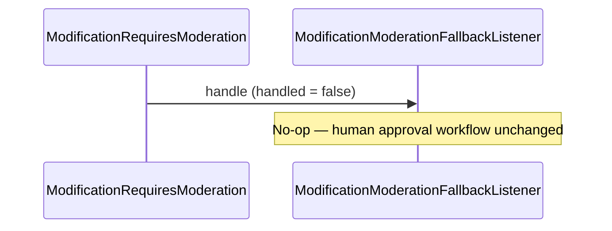
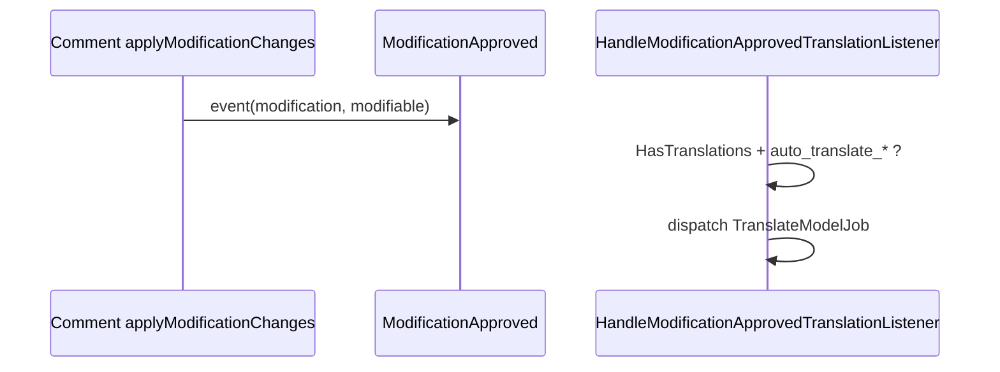

# Event orchestration (Core event bus)

> **RAG / assistant corpus:** a retrieval-optimized copy lives in [`docs/rag/EVENT_ORCHESTRATION.md`](rag/EVENT_ORCHESTRATION.md). Run `php artisan ai:index-docs` after editing it. This file is the full technical reference (extra diagrams).

Core owns the **contract** between domain modules (CMS, ERP, …) and optional capabilities (AI, search). Modules never import each other for these pipelines; they communicate through Core events, registries, and settings.

## Transactional outbox

`OutboxRecorder` persists a `core_outbox_events` row in the caller's database transaction and schedules `PublishOutboxEventJob` with `afterCommit()`. A rollback therefore removes the event together with the domain change. Each row has a stable UUID `event_id`, event and aggregate identifiers, JSON payload, occurrence/publication timestamps, attempt count, and last error.

The queued job is unique per outbox row, skips missing or already published rows, records failures, and calls the `OutboxPublisher` contract. Core binds `StubOutboxPublisher` by default: it performs no external I/O and the job marks the row published. Deployments that need broker, webhook, or event-stream delivery must replace that binding; consumers must use `event_id` as their idempotency key because delivery transports can be at least once.

This document describes two orchestration patterns:

1. **Search indexing** — `ModelRequiresIndexing` (embeddings + optional translation sync → Elasticsearch/Typesense)
2. **Modification moderation** — `ModificationRequiresModeration` (optional AI vote on pending approvals)

Both mirror the same ideas: emit always, optional AI pre-processing, cache coordination, Core finalize/fallback listeners.

---

## Design principles

| Principle | Implementation |
|-----------|----------------|
| Core is the bus | Events and registries live in `Modules\Core` |
| Domain modules register adapters | e.g. CMS registers `CommentModerationContextBuilder` |
| AI never imports CMS/ERP | AI resolves builders via `ModerationContextBuilderRegistry` |
| Opt-in per model | Settings: `ai_moderation_{table}`, `auto_translate_{table}`; search: `Searchable` + `$embed` |
| Fallback when AI skips | Indexing: Core still runs `IndexInSearchJob`; moderation: humans only (no-op) |

---

## 1. Search indexing (embeddings + translations)

### Trigger

Any model using `Modules\Core\Search\Traits\Searchable` calls `queueMakeSearchable()` / `makeSearchable()`, which dispatches:

- **Event:** `Modules\Core\Events\ModelRequiresIndexing`
- **Payload:** `Model $model`, `bool $sync`

### High-level flow



### Sequence (async, with embeddings)



### Translation synchronized with indexing

When a translatable **and** searchable model is saved:



If indexing was not started yet, translation runs **without** blocking on the indexing cache (see `HandleModelTranslationListener`).

### Fallback (AI disabled or model without embeddings)



### Cache keys and pre-processing types

| Cache key | Event type | Pre-processing keys |
|-----------|------------|---------------------|
| `model_indexing:{table}:{id}` | `ModelRequiresIndexing` | `embeddings`, `translation` |

### Core classes

| Class | Role |
|-------|------|
| `Events\ModelRequiresIndexing` | Orchestration state (`handled`, `required_pre_processing`, …) |
| `Events\ModelPreProcessingCompleted` | Signals one step finished (`embeddings`, `translation`) |
| `Listeners\IndexModelFallbackListener` | Index without AI when `!handled` |
| `Listeners\FinalizeModelIndexingListener` | Dispatches `IndexInSearchJob` when all steps complete |
| `Search\Jobs\IndexInSearchJob` | Writes document to Scout engine |

### AI classes

| Class | Role |
|-------|------|
| `Listeners\HandleModelIndexingListener` | Registers `embeddings`, dispatches `GenerateEmbeddingsJob` |
| `Jobs\GenerateEmbeddingsJob` | Persists vectors, emits `ModelPreProcessingCompleted` |
| `Listeners\HandleModelTranslationListener` | `TranslatedModelSaved` → `TranslateModelJob` |
| `Jobs\TranslateModelJob` | Fills translation rows, may emit `ModelPreProcessingCompleted('translation')` |

### Configuration (summary)

| Layer | Keys |
|-------|------|
| Scout / Core | `SCOUT_DRIVER`, `VECTOR_SEARCH_ENABLED`, model `$embed`, `vectorSearchEnabled()` |
| AI | `ai.features.embeddings.enabled`, embedding provider env vars |
| Per model | `auto_translate_{table}` (translations group) via `PerModelSettingResolver` |

See also: [Modules/AI/docs/SEARCH_AND_TRANSLATION.md](../AI/docs/SEARCH_AND_TRANSLATION.md).

---

## 2. Modification moderation (approvals + optional AI)

### Trigger

When an **active** `Modification` is **created** (`wasRecentlyCreated`), Core emits:

- **Event:** `Modules\Core\Events\ModificationRequiresModeration`
- **Payload:** `Modification $modification`, `bool $sync`

Emitter: `Modules\Core\Providers\EventServiceProvider` (no CMS-specific listener).

> Pending comments create a modification **before** the comment row is public; the event fires on first save even if `modifiable_id` is still null. The AI builder reads context from the modification JSON (`body`, `content_id`, …).

### Module boundaries



### Sequence (comment + AI enabled)



### Fallback (no AI)



Unlike indexing, there is **no** automated fallback step when AI skips moderation.

### Post-approval: translations



### Registry (opt-in per modifiable type)

```php
// Modules\Core\Contracts\ModerationContextBuilder
interface ModerationContextBuilder {
    public function supports(Modification $modification): bool;
    public function build(Modification $modification): ModerationContext;
}
```

CMS registers in `CMSServiceProvider::boot()`:

```php
$this->app->make(ModerationContextBuilderRegistry::class)
    ->register($this->app->make(CommentModerationContextBuilder::class));
```

### Cache keys

| Cache key | Purpose |
|-----------|---------|
| `modification_moderation:{modification_id}` | Cached `ModificationRequiresModeration` until `ModificationPreProcessingCompleted` |

### Core classes

| Class | Role |
|-------|------|
| `Events\ModificationRequiresModeration` | Same orchestration pattern as indexing |
| `Events\ModificationApproved` | `Modification` + `Model $modifiable` after apply |
| `Events\ModificationPreProcessingCompleted` | e.g. `ai_approval` step done |
| `Contracts\ModerationContextBuilder` | Domain adapter interface |
| `Services\ModerationContextBuilderRegistry` | Resolves builder by modification |
| `Listeners\ModificationModerationFallbackListener` | No-op if `!handled` |
| `Listeners\FinalizeModificationModerationListener` | Clears cache when steps complete (v1) |
| `Services\PerModelSettingResolver` | Cached DB flags (`ai_moderation_*`, …) |

### Configuration (summary)

| Layer | Keys |
|-------|------|
| AI global | `ai.features.moderation.*` (`AI_MODERATION_*` env) |
| Per model | Setting `ai_moderation_{table}` (group `moderation`) or property `$ai_moderation_enabled` |
| System actor | `ai.features.moderation.system_user_id` (`AI_MODERATOR_USER_ID`) |

See also:

- [Modules/AI/docs/MODERATION.md](../AI/docs/MODERATION.md) — AI listeners, job, thresholds
- [Modules/CMS/docs/COMMENT_MODERATION.md](../CMS/docs/COMMENT_MODERATION.md) — comment capture and CMS adapter

---

## Comparison

| Aspect | Search indexing | Modification moderation |
|--------|-----------------|-------------------------|
| Core event | `ModelRequiresIndexing` | `ModificationRequiresModeration` |
| AI pre-processing key | `embeddings`, `translation` | `ai_approval` |
| Core fallback if AI skips | **Runs** `IndexInSearchJob` | **No-op** (humans only) |
| Domain adapter | Model traits (`Searchable`, `HasTranslations`) | `ModerationContextBuilder` registry |
| Durable outcome | Search index + embeddings table | `approvals` / `disapprovals` + `meta` |
| Post-success event | `ModelPreProcessingCompleted` | `ModificationPreProcessingCompleted` |

---

## Extending

### New searchable model

1. Add `Searchable` trait and implement `toSearchableArray()` / `$embed`.
2. Ensure `ai.features.embeddings.enabled` and provider configured.
3. Optionally enable `auto_translate_{table}` for `TranslatedModelSaved` flow.

### New moderatable model

1. Implement `ModerationContextBuilder` in the domain module.
2. Register it on `ModerationContextBuilderRegistry` in the module `ServiceProvider`.
3. Seed or enable `ai_moderation_{table}` for models using `HasApprovals`.
4. No changes required in the AI module.

---

## Related specs

- `docs/superpowers/specs/2026-05-15-modification-moderation-design.md` — moderation design (orchestration)
- `docs/superpowers/specs/2026-05-15-cms-comments-moderation-design.md` — comment product rules (thresholds, Filament, ratings)
