# Core module — platform runtime and cross-cutting capabilities

## Purpose

`Core` is the platform runtime for Laraplate. It owns identity and authentication (Fortify + Sanctum + social + 2FA + impersonation + license), authorization (Spatie roles/permissions + row-level ACLs), the record lifecycle stack (`SoftDeletes`, `HasVersions`, `HasApprovals`, `HasValidity`, `HasLocks`, `HasOptimisticLocking`), the dynamic-entity infrastructure (`Entity`/`Preset`/`Presettable`/`Field`), the schema inspector + `DynamicEntity` runtime, the CRUD pipeline (`CrudService` + `AuthorizationService` + `QueryBuilder`), the translations stack (`HasTranslations` + `LocaleContext` + `LocaleScope`), the search abstractions (`Searchable` + `SchemaDefinition` + `ISearchEngine`), the Core Graph framework (`GraphService`, graph requests, traversal, providers, and stats), the canonical `Place` + geocoding contracts, and the settings-backed module activator. Other modules (`AI`, `CMS`, `ERP`, `MES`) consume these primitives instead of reinventing them.

### Module boundaries

Every other module in Laraplate depends on Core. HTTP/Filament/Artisan entry points pass through Fortify/Sanctum and Core middleware; controllers and services use `CrudService` (or directly Eloquent on `Core\Overrides\Model`) which consumes `AuthorizationService` + `AclResolverService` + `QueryBuilder` to enforce permissions and ACL filters. The dynamic-entity stack (`Entity`/`Preset`/`Presettable`/`Field`) is shared across CMS/ERP. Search routes through `Searchable` + `ISearchEngine`, with optional AI overrides (`IReranker`, `ISearchPlanner`, `IQueryIntentParser`). Graph routes live under `/crud/graph/*` and reuse CRUD entity resolution, request semantics, authorization, and response conventions. Geocoding goes via `IGeocodingService` (Nominatim or Google Maps). Module activation is driven by `ModuleDatabaseActivator` reading the `backendModules` setting.

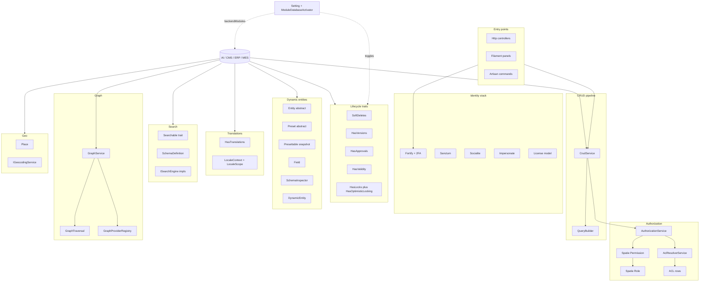

## Capability map

### Identity, authentication and license

`Core\Models\User` extends Laravel's base auth user and stacks `HasRoles` (Spatie), `ApprovesChanges` (Approval), `HasVersions`, `HasValidity`, `HasLocks`, `SoftDeletes`, `TwoFactorAuthenticatable`, and `Impersonate`. Login flows are wired through Fortify (with optional 2FA via `ENABLE_USER_2FA`) and optional Socialite providers. The `License` model is one-to-one with users (`users.license_id`) and joins on validity windows; commands `auth:licenses`, `auth:free-all-licenses`, and `auth:free-expired-licenses` reconcile state. `Impersonate` is gated by `User::canImpersonate()` (super-admin or `users.impersonate` permission); Filament panel access is decided by `canAccessPanel()` which short-circuits for super-admins.

#### User temporal validity (temporary accounts)

The `users` table includes `valid_from` and `valid_to` (via `MigrateUtils::timestamps(..., hasValidity: true)`). `User` composes `HasValidity` so accounts can be **time-boxed**: a temporary user stops being valid when `valid_to` is in the past, without soft-delete or manual intervention.

| Pattern | `valid_from` | `valid_to` | Runtime helpers |
| --- | --- | --- | --- |
| Permanent (seeded system users) | `now()` | `null` | `isValid()` while `valid_from <= today` |
| Temporary / contractor | start datetime | end datetime | `isValid()` inside window; `isExpired()` after `valid_to` |
| Scheduled (not yet active) | future | optional end | `isScheduled()` |
| Unset / draft | `null` | `null` | `isDraft()` — treat as inactive for access decisions |

Set the window with mass assignment, Filament, or `User::publish(?Carbon $valid_from, ?Carbon $valid_to)` / `unpublish()` from `HasValidity`. Query helpers: `User::query()->valid()`, `->expired()`, `->scheduled()`, `->draft()`.

Unlike CMS `Content`, `User` does **not** register a `valid` global scope in `booted()`; scopes and `isValid()` must be applied explicitly (e.g. `FortifyCredentialsProvider`, `SocialiteProvider`, or auth middleware calling `! $user->isValid()`). Sessions started before `valid_to` may remain active until expiry unless a middleware re-checks validity on each request.

Seeded accounts in `CoreDatabaseSeeder` use `valid_from => now()` and `valid_to => null` so built-in superadmin/admin/guest/system users stay perpetual.

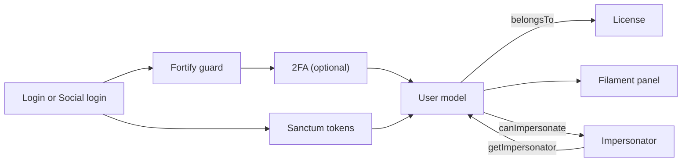

### Authorization: roles, permissions and ACLs

Authorization is a two-layer stack. Layer 1 is **Spatie roles + permissions** (`Core\Models\Role` and `Core\Models\Permission`, the latter with `acls()` HasMany). Layer 2 is **row-level ACLs** (`Core\Models\ACL`) tied to a permission and carrying a `FiltersGroup` (JSON query-builder filters), plus an `unrestricted` flag and a `priority`. `AclResolverService::getEffectiveAcls()` resolves ACLs per role with parent-role inheritance (closure-table ancestors), super-admin bypass, OR-composition across non-hierarchical roles, and a 1-hour cache (`acl:resolved:user:{id}:perm:{id}`). `AuthorizationService` is the single entry point used by `CrudService` to enforce permissions and inject ACL filters into request data.

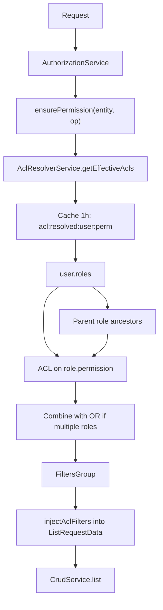

### Record lifecycle traits stack

A Core model can compose any subset of: `SoftDeletes` (`deleted_at` + `is_deleted` runtime toggleable via `soft_deletes_{table}` setting), `HasVersions` (uses `Overtrue\LaravelVersionable` underneath, toggled by `version_strategy_{table}` in group `versioning` and supports DIFF or SNAPSHOT), `HasApprovals` (uses Approval `RequiresApproval` and `Modification` model + `preview` flag), `HasValidity` (`valid_from`/`valid_to` columns plus scopes `valid()`, `expired()`, `scheduled()`, `draft()`; some models such as CMS `Content` also add a `valid` global scope in `booted()`), `HasLocks` (`is_locked`/`locked_at`/`locked_by`), and `HasOptimisticLocking` (`lock_version`). The state diagram below summarises how a row moves through these phases when traits are stacked together (e.g. as on `User` or CMS `Content`).

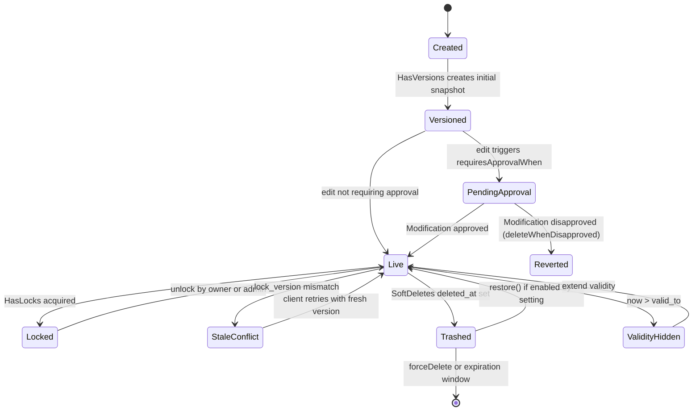

### Versioning flow

`HasVersions` (extends `Overtrue\LaravelVersionable\Versionable`) controls whether a save creates a new version using `getVersionStrategy()`. The strategy is read with two-level caching: an L1 in-memory map per request and an L2 persistent cache fed by the `version_strategy_{table}` setting in group `versioning`. When versioning is enabled, the trait emits `ModelVersioningRequested` and dispatches `CreateVersionJob` (after-commit) so the `VersioningService` writes a `Core\Models\Version` row with `contents` (DIFF) or full snapshot (SNAPSHOT). Reverts use `Version::revertWithoutSaving()`, replaying previous versions for DIFF or applying the initial snapshot for SNAPSHOT. `createSnapshotVersion()` plus `purgeOldVersionsAfterCreate` enables history compaction.

If a concrete model declares its own `versionStrategy = VersionStrategy::DIFF`, that class property takes precedence and is not runtime-configurable. `ForcedVersionStrategySettings` discovers those models across active/inactive modules; `SettingResource`, tabs, filters, and form validation hide/reject matching historical `version_strategy_{table}` rows without deleting them.

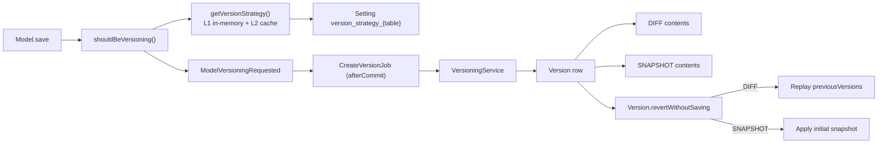

### Approvals and preview

`HasApprovals` wraps the Approval package's `RequiresApproval` and adds a `preview` flag driven by request middleware + session. When `requiresApprovalWhen()` returns true (default: any modification by a non-admin/super-admin in HTTP context), the change is persisted as a `Modification` instead of touching the row. While `preview()` is true, the trait appends a `preview` accessor that overlays pending modifications on top of stored attributes via `toArray()`. Disapproval triggers `deleteWhenDisapproved`. Domain models can narrow the rule (e.g. CMS `Content` only requires approval when the validity window changes; ERP `Setting` requires approval on any non-`description` field).

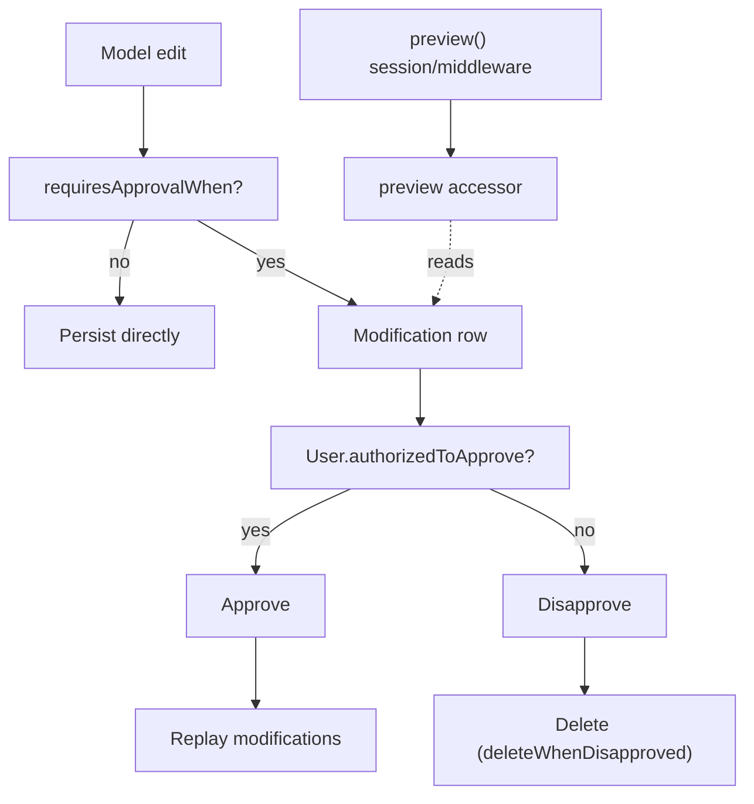

### Dynamic entities, presets and fields

The dynamic-entity stack lets modules describe domain objects without writing one table per type. `Core\Models\Entity` is **abstract**: each module subclass pins an `EntityType` enum (CMS uses `CONTENTS|CONTRIBUTORS|CATEGORIES`). `Core\Models\Preset` is also abstract and hosts `BelongsToMany Field` via the `fieldables` pivot (with `is_required`, `default`, `order_column`). When a preset's fields change, `Preset::createFieldsVersion()` (delegated to `PresetVersioningService`) writes a new `Presettable` row with a `fields_snapshot` and an incremented `version`. Each domain row carries `entity_id` + `presettable_id`, so schema changes do not break older rows: `Preset::migrateRelatedModelsToLastVersion()` reassigns related rows to the active presettable when ready.

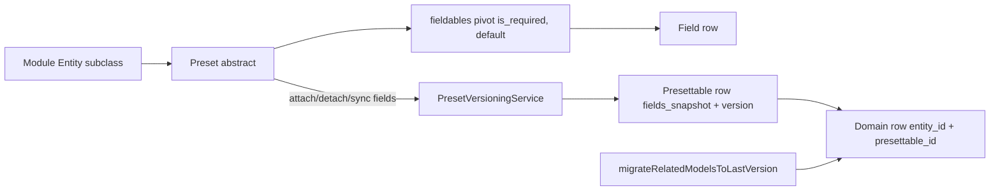

### Schema inspector and DynamicEntity

`SchemaInspector` reads columns/indexes/foreign keys from the live DB and keeps a shared in-memory cache (plus persistent cache via Laravel cache for cross-request reuse). `DynamicEntityService` is a singleton that resolves a table name to either a concrete model (`User` for `users`) or to a `Core\Models\DynamicEntity` instance whose `inspect()` method populates `fillable`, `casts`, validation rules (`type`, `min:0`, `required`, `exists:`, `unique:`), primary key info, and HasMany / BelongsToMany dynamic relations from foreign keys + indexes. CRUD/Grid layers reuse this metadata so adding a column to a table is reflected in routes/forms without re-deploying code. Cache invalidation is exposed via `clearAllCaches()` and the `inspector:warm` command.

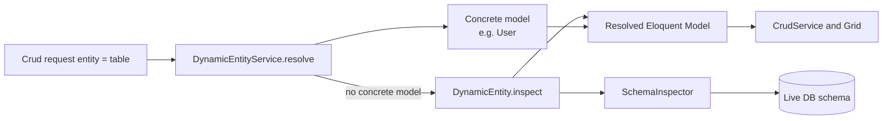

### CRUD pipeline

`CrudService` is the unified entry for list/detail/history/tree/search/insert/update/delete. Each read operation runs in this order: (1) `AuthorizationService::ensurePermission()` (super-admin bypass + `hasPermissionTo`), (2) `AuthorizationService::injectAclFilters()` which merges the resolved `FiltersGroup` (AND with caller filters) into request data, (3) `QueryBuilder::prepareQuery()` builds the Eloquent query (filters/sort/relations/cursor), (4) execution either by pagination, range, or others, with optional `applyComputedMethods` and `applyGroupBy`, returning a `CrudResult` with `CrudMeta`. Write operations stack lock checks (`HasLocks`/`HasOptimisticLocking`) and approval routing (`RequiresApproval`).

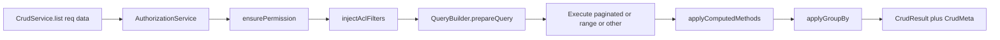

### Graph framework

Core Graph is a CRUD extension, not a CMS-only subsystem. Routes are mounted under `/crud/graph`: `expand/{module}/{entity}/{id}` extends detail, `search/{module}/{entity}` extends CRUD search, and `stats/{module}/{entity}/{id}` derives analytics from the same authorized expansion returned by `expand`. `ExpandGraphRequest` extends `DetailRequest`; `SearchGraphRequest` extends `SearchRequest` and keeps `qs`, `mode`, pagination, filters, sorts, and `limit` with their CRUD meanings. Graph adds only `relations[]`, `depth`, `relation_limit`, and `node_detail`.

Traversal is explicit. Requested `relations[]` are the only traversed paths; without explicit relations Core asks an optional provider for defaults, otherwise it returns only the center/search seed nodes. Authorization uses `AuthorizationService`: inaccessible centers fail like CRUD detail, while inaccessible neighbor nodes are omitted and reported through `graphMeta.filteredByAcl`. Cross-module nodes keep their own `{module}:{entity}:{id}` identity and their own CRUD permission checks.

Providers are optional. `GraphProviderInterface` supplies default relations, summary fields, edge labels, and exclusions. `GraphProviderRulesInterface` can narrow allowed paths, max depth, and per-relation limits. Runtime traversal remains the source of truth for `expand`, `search`, and `stats`; materialized edges are deferred until real benchmarks and an invalidation/freshness strategy justify storage. Stable developer reference: [GRAPH_SYSTEM.md](../GRAPH_SYSTEM.md).

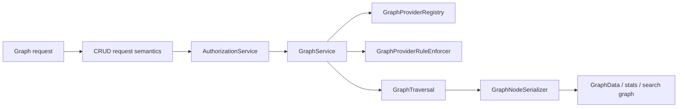

### Application content retrieval contract

Application content retrieval is a neutral Core extension boundary for read-only, AI-consumable evidence. It is separate from documentation RAG and Core Graph. `ApplicationContentRetrievalProviderInterface` exposes a typed source descriptor and a retrieval method; `ApplicationContentRetrievalProviderRegistryInterface` stores explicitly registered providers under deterministic normalized source keys. Duplicate sources fail during registration. Core does not discover providers through events, reflection, class names, or container scans, and it does not depend on the AI module.

`ApplicationContentRetrievalService` is the only production gateway. It requires the same authenticated Core user in both the request resolver and the active guard, verifies that the provider module is enabled, enforces the source entity's `select` permission, resolves row ACL filters, calls the provider, and validates result invariants. Unknown sources, identity disagreement, permission denial, provider failure, invalid locale, and malformed evidence all become the same generic unavailable failure.

The public DTO boundary is deliberately small:

- source descriptors contain module/entity identity, supported locales, bounded capabilities, and intent categories;
- queries contain only source, natural-language query, locale, and a bounded limit;
- authorization contains the server-resolved permission and optional `FiltersGroup` and never enters an AI payload;
- hits contain safe plain-text evidence, a user-facing label, a canonical `/app/...` reference, locale, strategy, revision, and truncation state.

Providers must apply ACL constraints before or during candidate lookup, rehydrate candidates through an authorized query, and project allowlisted fields. They must never return raw engine `_source`, Eloquent arrays, storage paths, permission names, ACL expressions, class names, table names, or connection/index identifiers. Events remain suitable for indexing, invalidation, deletion, and freshness notifications after explicit registration; they are not a provider injection mechanism.

### Translations and locale

`HasTranslations` keeps translatable fields in a sibling table (auto-resolved as `Models\Translations\{Model}Translation` and required to implement `ITranslated`). Setting a translatable attribute stores it under `pending_translations[locale][field]` until the model fires `saved`, at which point translations are upserted in batch. Reads consult: pending values, the loaded `translation` relation, then the loaded `translations` collection, then a targeted DB query — with optional fallback to default locale when `LocaleContext::isFallbackEnabled()` is true. A `LocaleScope` global scope eagerly loads the right `translation` per the active `LocaleContext`. After create/update of the default-locale translation the trait emits `TranslatedModelSaved`, which the AI module listens to in order to enqueue automatic translations for other locales.

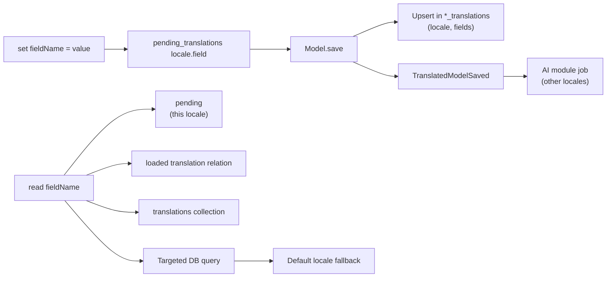

### Search abstractions and engines

`Searchable` extends Elastic Scout Plus and adds: a `SchemaDefinition` driven by `FieldDefinition` + `IndexType` enums, a `SchemaManager` that synchronises engine schemas, and event-based indexing (`ModelRequiresIndexing` → `ReindexSearchJob` / `IndexInSearchJob` / `BulkIndexSearchJob` / `FinalizeReindexJob`) so listeners can pre-process embeddings or translations before the document is sent to the engine. `ISearchEngine` is bound to the active Scout engine (Typesense or Elasticsearch); database fallback is also provided. Optional AI overrides bind `IReranker`, `ISearchPlanner`, and `IQueryIntentParser` (Core ships heuristic fallbacks via `HeuristicReranker`, `FallbackSearchPlanner`, `SimpleQueryIntentParser`).

For durable cross-system integration, `OutboxRecorder` writes `core_outbox_events` in the same transaction as the domain operation and schedules `PublishOutboxEventJob` after commit. Delivery uses the replaceable `OutboxPublisher`; the default stub performs no external I/O. Event UUIDs are the consumer idempotency keys.

For operator-triggered bulk imports, Core provides `AbstractImportCommand`, `BulkImporterInterface`, optional `ConnectionAwareBulkImporterInterface`, module-injected resolver/discovery contracts, `ContainerBulkImporterResolver`, `FilesystemImportPluginDiscovery`, and `BulkImportRunner`. Core intentionally registers no `core:import`: concrete modules expose destination-specific commands and marker interfaces. Shared options are inherited through `getOptions()` (`--importer`, `--bootstrap`, repeatable `--arg`, `--dry-run`, `--limit`, `--no-search`). Dry-run rolls back only the importer-declared connection, or the default connection when none is declared; importers must suppress files, queues, HTTP calls, other connections, and other non-transactional side effects. Continuous synchronization remains a separate design requiring cursors, identities, conflicts, retries, and scheduling.

Advanced search filters are engine-owned before pagination. Scalar filters are allowed only on schema-declared filterable/facetable fields when a searchable schema exists. Indexed relation-field filters use dot paths such as `tags.id`, but only when the searchable schema declares the parent field and marks the nested property filterable/facetable. Elasticsearch receives nested queries, Typesense receives nested-field dot notation, and database search translates the same request to `whereHas` / `whereDoesntHave` through the schema field option `relation`. For relation fields, `!=` and `not in` mean anti-exists: no related indexed row may match the value/list.

Portable text matching is represented by granular `TextMatchOptions`; named profiles are presets rather than engine-level types. Elasticsearch and Typesense translate typo tolerance, prefix matching, term-length thresholds, and exact-match preference into native parameters. `ISearchEngine::textMatchCapabilities()` publishes native and degraded behavior. Database search always has a case-insensitive prefix or substring fallback. PostgreSQL can opt into `pg_trgm` `strict_word_similarity()` with `SEARCH_DATABASE_PG_TRGM_ENABLED=true`. Oracle remains on the portable fallback because `UTL_MATCH` is not suitable for generic indexed retrieval over long text; Oracle Text requires a future schema-aware adapter with explicit `CONTEXT` indexes.

Adaptive query matching analyzes individual tokens before engine translation. Short names remain exact-first with limited typo tolerance; acronyms, codes, UUIDs, emails, numbers, and short tokens are protected. Two meaningful words use strict token coverage, while longer natural-language queries lower the required token percentage. Public `qs` syntax also supports mandatory exact phrases with quotes and mandatory position-independent terms with `+`; both remain non-fuzzy. Optional request preferences, syntax, and granular overrides are documented in [SEARCH_MATCHING_USER.md](./SEARCH_MATCHING_USER.md); internal parsing, resolution, engine mapping, PostgreSQL prerequisites, and Oracle constraints are documented in [SEARCH_MATCHING_DEVELOPER.md](./SEARCH_MATCHING_DEVELOPER.md).

**Event orchestration (indexing + moderation):** Core emits `ModelRequiresIndexing` and `ModificationRequiresModeration`; the AI module registers optional pre-processing (embeddings, translation, `ai_approval`); Core finalize/fallback listeners complete indexing or leave moderation to humans. Per-model toggles: `auto_translate_{table}`, `ai_moderation_{table}` via `PerModelSettingResolver`. Full RAG-oriented flow: [EVENT_ORCHESTRATION.md](./EVENT_ORCHESTRATION.md) in this folder; extended diagrams: `Modules/Core/docs/EVENT_ORCHESTRATION.md`.

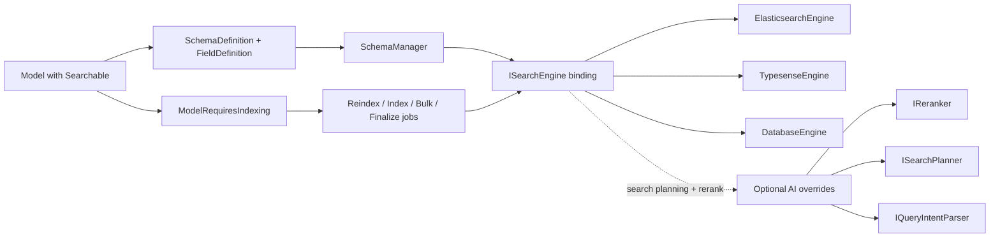

### Place and geocoding

`Core\Models\Place` is the canonical postal/geographic row shared across modules (CMS `Location.place_id`, ERP `Site.place_id`). It uses `HasSpatial` for a `geolocation` Point and exposes `searchDocumentGeographyFields()` so consumers can flatten the same shape into search documents. `Place::saving` keeps decimal `latitude`/`longitude` and the binary `geolocation` Point in sync; `geolocation` is excluded from version snapshots (binary WKB breaks JSON encoding on `Version`). Geocoding is delegated to `IGeocodingService` (Core), with concrete providers (`NominatimService` and `GoogleMapsService`) selected by config.

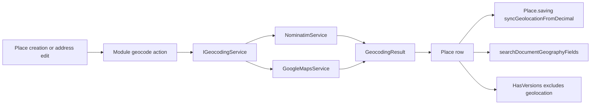

### Settings and module activation

Runtime configuration lives in `Setting` (`Core\Models\Setting` with `HasApprovals` + `HasCache`). Three setting groups drive behaviour: `soft_deletes` (toggles `SoftDeletes` per table via `soft_deletes_{table}`), `versioning` (`version_strategy_{table}`), and `modules` (the `backendModules` JSON array consumed by `ModuleDatabaseActivator`). The activator implements the Nwidart `ActivatorInterface` and reads/writes `backendModules` straight via `DB::table('settings')` (so it works during boot when Eloquent isn't ready), with optional cache. Editing `Setting` triggers `SettingObserver` and Approval flows on any non-`description` field.

The Settings UI exposes only genuinely configurable rows. Class-forced DIFF strategies are intentionally absent even if stale rows remain in the database.

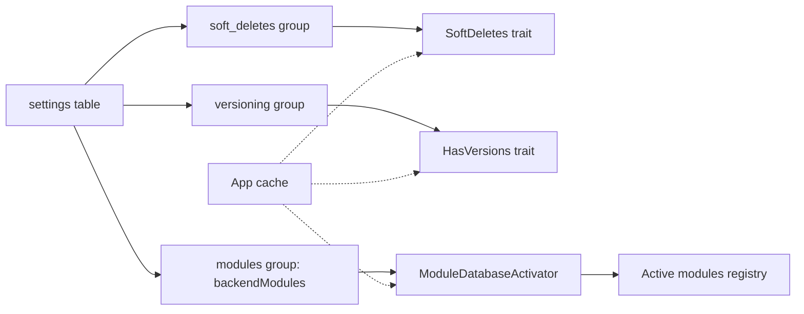

## Built-in abstractions used by other modules

Core exposes reusable primitives for module authors:

- UI/resource helpers (`HasTable`, `HasRecords`, `HasSlug`, `HasPath`, `HasActivation`, `SortableTrait`).
- Data lifecycle traits (`HasVersions`, `SoftDeletes`, `HasLocks`, `HasOptimisticLocking`, `HasApprovals`, `HasValidity`).
- Translation primitives (`HasTranslations`, `HasTranslatedDynamicContents`, `LocaleContext`, `LocaleScope`).
- Dynamic-entity primitives (`Entity`, `Preset`, `Presettable`, `Field`, `DynamicEntity`).
- CRUD/Grid request DTOs and `CrudService`/`AuthorizationService`/`AclResolverService`.
- Searchable trait + `SchemaDefinition` + `ISearchEngine`/`IReranker`/`ISearchPlanner`/`IQueryIntentParser`.
- Graph providers and traversal services (`GraphService`, `GraphTraversal`, `GraphProviderInterface`, `GraphProviderRulesInterface`).
- Geocoding contracts and providers (`IGeocodingService`, `NominatimService`, `GoogleMapsService`).
- Settings infrastructure and module activation.

When building new module features, reuse these primitives instead of re-implementing lifecycle logic.

## Core command catalog (developer operations)

### Identity, permissions, approvals

- `auth:create-user`
- `permission:refresh`
- `approvals:check-pending`

### Licenses

- `auth:licenses`
- `auth:free-all-licenses`
- `auth:free-expired-licenses`

### Locking and concurrency

- `lock:refresh`
- `lock:locked-add` / `lock:locked-remove` (often aliased as `lock:add` / `lock:remove`)
- `lock:optimistic-add` / `lock:optimistic-remove`

### Soft delete lifecycle

- `model:clear-expired`
- `model:soft-deletes-add`
- `model:soft-deletes-remove`
- `model:soft-deletes-refresh`

### Translation and translatable conversion

- `make:model-translatable`
- `make:translation`
- `lang:check-translations`

### Inspector and dynamic schema cache

- `inspector:warm`
- entity cache clear via CRUD route (`cache-clear/{entity}`)

### API docs

- Swagger generation command (module-specific command wiring in Core console)

## How to use Core capabilities correctly

### For product/admin teams

- Manage users/roles/ACL/settings in Filament resources.
- Use approval queues and preview when moderation is enabled.
- Keep module activation and runtime settings under change-control.

### For API/front-end teams

- Use `/crud` and `/crud/grid` with permission-aware query behavior.
- Use `/crud/graph/expand`, `/crud/graph/search`, and `/crud/graph/stats` when clients need graph-shaped entity data; request relations explicitly unless a module provider defines defaults.
- Handle lock/version conflicts explicitly in UX (retry/reload patterns).
- Consume Swagger docs generated by Core as source of API contract.

### For module developers

- Prefer Core lifecycle traits over custom ad-hoc implementations.
- Use settings groups for runtime switches when behavior must be configurable per table/module.
- Reuse inspector-driven metadata and avoid hardcoded schema assumptions.

## Locking toggle design note (planned extension)

The platform already supports runtime toggles for soft deletes and versioning per table. A similar runtime toggle for locking (`locking_{table}`) is under evaluation to provide parity, with strict safeguards to avoid accidental concurrency regressions.

## Troubleshooting quick guide

- Permission mismatch despite role assignment: refresh permissions and verify ACL chain/inheritance.
- Unexpected missing records: check soft-delete scopes and preview mode.
- Revert/rollback confusion: verify version strategy (`DIFF` vs `SNAPSHOT`) for the table.
- Concurrent update failures: inspect lock status and `lock_version` mismatch path.
- Dynamic entity metadata stale: warm or clear inspector caches.
- API docs outdated: regenerate Swagger/OpenAPI and verify version merge outputs.
- Translation fallback not kicking in: check `LocaleContext::isFallbackEnabled()` and confirm the default-locale translation row exists.

## FAQ prompts for RAG

- How do ACL filters merge when a user has multiple roles?
- What is the difference between record lock and optimistic lock in Core?
- How do I rollback a record to a previous version?
- How can I disable soft deletes for one specific table at runtime?
- How are pending approvals previewed before final approval?
- How does module activation through settings work?
- How do I regenerate and publish Swagger docs after route changes?
- How do license checks affect login for normal users versus superadmins?
- How do I create a temporary user account with `valid_from` / `valid_to` on `users`?
- What is the difference between `User::isExpired()`, `isScheduled()`, and `isDraft()`?
- Should login providers check `User::isValid()` for time-boxed accounts?
- How do I convert an existing model to translation-table architecture?
- What should I clear when dynamic entity metadata looks outdated?
- When is `Presettable.fields_snapshot` updated and how do related rows migrate?
- How do `IReranker` / `ISearchPlanner` / `IQueryIntentParser` interact with the AI module?
- Why does `Place` exclude `geolocation` from version snapshots?
