# Core module — platform runtime and cross-cutting capabilities

## Purpose

`Core` is the platform runtime for Laraplate. It owns identity and authentication (Fortify + Sanctum + social + 2FA + impersonation + license), authorization (Spatie roles/permissions + row-level ACLs), the record lifecycle stack (`SoftDeletes`, `HasVersions`, `HasApprovals`, `HasValidity`, `HasLocks`, `HasOptimisticLocking`), the dynamic-entity infrastructure (`Entity`/`Preset`/`Presettable`/`Field`), the schema inspector + `DynamicEntity` runtime, the CRUD pipeline (`CrudService` + `AuthorizationService` + `QueryBuilder`), the translations stack (`HasTranslations` + `LocaleContext` + `LocaleScope`), the search abstractions (`Searchable` + `SchemaDefinition` + `ISearchEngine`), the Core Graph framework (`GraphService`, graph requests, traversal, providers, and stats), the canonical `Place` + geocoding contracts, and the settings-backed module activator. Other modules (`AI`, `CMS`, `ERP`, `MES`) consume these primitives instead of reinventing them.

### Module boundaries

Every other module in Laraplate depends on Core. HTTP/Filament/Artisan entry points pass through Fortify/Sanctum and Core middleware; controllers and services use `CrudService` (or directly Eloquent on `Core\Overrides\Model`) which consumes `AuthorizationService` + `AclResolverService` + `QueryBuilder` to enforce permissions and ACL filters. The dynamic-entity stack (`Entity`/`Preset`/`Presettable`/`Field`) is shared across CMS/ERP. Search routes through `Searchable` + `ISearchEngine`, with optional AI overrides (`IReranker`, `ISearchPlanner`, `IQueryIntentParser`). Graph routes live under `/crud/graph/*` and reuse CRUD entity resolution, request semantics, authorization, and response conventions. Geocoding goes via `IGeocodingService` (Nominatim or Google Maps). Module activation is driven by `ModuleDatabaseActivator` reading the `active_modules` setting.

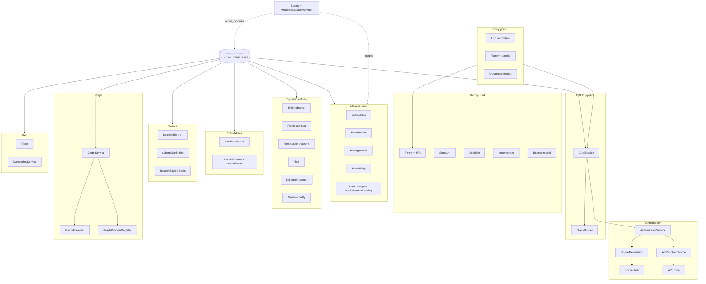
```mermaid
flowchart TB
  subgraph entry [Entry points]
    Http[Http controllers]
    Filament[Filament panels]
    Artisan[Artisan commands]
  end
  subgraph identity [Identity stack]
    Fortify[Fortify + 2FA]
    Sanctum[Sanctum]
    Social[Socialite]
    Impersonate[Impersonate]
    License[License model]
  end
  subgraph authz [Authorization]
    Roles[Spatie Role]
    Perms[Spatie Permission]
    Acls[ACL rows]
    AclSvc[AclResolverService]
    AuthSvc[AuthorizationService]
  end
  subgraph crud [CRUD pipeline]
    CrudSvc[CrudService]
    QB[QueryBuilder]
  end
  subgraph lifecycle [Lifecycle traits]
    Soft[SoftDeletes]
    Vers[HasVersions]
    App[HasApprovals]
    Val[HasValidity]
    Locks[HasLocks plus HasOptimisticLocking]
  end
  subgraph dyn [Dynamic entities]
    Entity[Entity abstract]
    Preset[Preset abstract]
    Presettable[Presettable snapshot]
    Field[Field]
    Inspect[SchemaInspector]
    DynEnt[DynamicEntity]
  end
  subgraph i18n [Translations]
    HasTrans[HasTranslations]
    Locale[LocaleContext + LocaleScope]
  end
  subgraph search [Search]
    SearchTrait[Searchable trait]
    Schema[SchemaDefinition]
    Engines[ISearchEngine impls]
  end
  subgraph graph [Graph]
    GraphSvc[GraphService]
    Traversal[GraphTraversal]
    Providers[GraphProviderRegistry]
  end
  subgraph place [Geo]
    PlaceM[Place]
    Geo[IGeocodingService]
  end
  Settings[Setting + ModuleDatabaseActivator]
  Modules[(AI / CMS / ERP / MES)]

  entry --> Fortify
  entry --> CrudSvc
  CrudSvc --> AuthSvc --> AclSvc --> Acls
  AuthSvc --> Perms --> Roles
  CrudSvc --> QB
  Modules --> CrudSvc
  Modules --> lifecycle
  Modules --> dyn
  Modules --> i18n
  Modules --> search
  Modules --> GraphSvc
  GraphSvc --> Traversal
  GraphSvc --> Providers
  Modules --> place
  Settings -.->|toggles| lifecycle
  Settings -.->|active_modules| Modules
```

## Capability map

### Identity, authentication and license

`Core\Models\User` extends Laravel's base auth user and stacks `HasRoles` (Spatie), `ApprovesChanges` (Approval), `HasVersions`, `HasValidity`, `HasLocks`, `SoftDeletes`, `TwoFactorAuthenticatable`, and `Impersonate`. Login flows are wired through Fortify (with optional 2FA via the `core.auth.two_factor.enabled` runtime setting) and optional Socialite providers. The `License` model is one-to-one with users (`users.license_id`) and joins on validity windows; commands `auth:licenses`, `auth:free-all-licenses`, and `auth:free-expired-licenses` reconcile state. `Impersonate` is gated by `User::canImpersonate()` (super-admin or `users.impersonate` permission); Filament panel access is decided by `canAccessPanel()` which short-circuits for super-admins.

**Login methods and the second factor.** Password, social and passkey logins are independent runtime switches (`auth.social_login.enabled`, `auth.passkeys.enabled`; the password login is always on). Each login method declares through `IAuthenticationProvider::satisfiesSecondFactor()` whether it already carries a second factor, and `RedirectIfSecondFactorRequired` (Fortify's two-factor redirect, replaced) asks for the TOTP only when it does not:

| Method | Switch | Creates users | TOTP challenge |
|---|---|---|---|
| Password | always on | only through `auth.registration.enabled` | yes, when the user confirmed a TOTP and `auth.two_factor.enabled` is on |
| Social | `auth.social_login.enabled` | only when `auth.registration.enabled` is on; a known `social_id` always logs in; a known email on another account type is refused | no (the provider owns it) |
| Passkey | `auth.passkeys.enabled` | never (registered by a logged-in user, with password confirmation) | no (device possession plus biometric or PIN) |

A passkey login runs the account checks of the password flow before the session starts (`PasskeyLoginAuthorizer`: active account, at least one role, verified email when required, license) plus the optional module `scope`. Passkeys live in `core_passkeys` (`Core\Models\Passkey` on the `laravel/passkeys` package, pre-1.0). The relying party id is the host of `APP_URL`, so changing the domain invalidates the registered passkeys. Listing and revoking passkeys is a UI concern; the Fortify routes (`/passkeys/...`, `/user/passkeys`) exist when the switch is on.

**Scoped login (module SPAs).** The login accepts an optional `scope` (a module slug, e.g. `sao`) which module UIs send from their app config. When present, `Fortify::authenticateUsing` calls `AuthorizationService::userHasModuleAccess($user, $scope)` and rejects the login (validation error `auth.module_scope_denied`) unless the user holds at least one permission on that module's entities; no scope means an ordinary login. The check is a single indexed lookup on the `permissions.module_name` generated column (the table prefix before the first underscore, e.g. `sao_tickets` → `sao`; generated via STORED expressions on Postgres/MySQL and triggers on SQLite, alongside `connection_name`/`table_name`), covering direct permissions and permissions granted via the user's roles. Super admins always pass. **Every module SPA logs in scoped to its own module** — this is a shared frontend convention (see the UI monorepo `CLAUDE.md`).

**After a login.** Two listeners on `Illuminate\Auth\Events\Login`, registered explicitly in Core's `EventServiceProvider` (event discovery does not scan module folders). `AfterLoginListener` stamps `users.last_login_at` and, with the `core.auth.licenses.enabled` setting on, assigns a free license to a user who has none; an impersonation session only logs who is impersonating whom. `LogoutOtherDevicesListener` ends the user's sessions on every other device when licenses are on, since a license is one seat; super admins hold no seat and are exempt, as they are from every license check. It needs the password in clear, so it only acts on password logins (it reads the password from the `Attempting` event of the same request and holds it in a scoped instance); social login, impersonation and remember-me cookies leave other sessions alone. Other sessions are detected through the `AuthenticateSession` middleware.

**Locked user accounts.** A lock on a user row blocks edits to the account, not the account's use. `User::attributesWritableWhileLocked()` lets `remember_token` and `last_login_at` through; the `eloquent` user provider is replaced by `Locking\LockAwareUserProvider`, which suspends the lock guard for the password rehash done after credentials are validated (a hash of the same secret, not a password change).

#### User temporal validity (temporary accounts)

The `users` table includes `valid_from` and `valid_to` (via `MigrateUtils::timestamps(..., hasValidity: true)`). `User` composes `HasValidity` so accounts can be **time-boxed**: a temporary user stops being valid when `valid_to` is in the past, without soft-delete or manual intervention.

| Pattern | `valid_from` | `valid_to` | Runtime helpers |
| --- | --- | --- | --- |
| Permanent (seeded system users) | `now()` | `null` | `isValid()` while `valid_from <= today` |
| Temporary / contractor | start datetime | end datetime | `isValid()` inside window; `isExpired()` after `valid_to` |
| Scheduled (not yet active) | future | optional end | `isScheduled()` |
| Unset / draft | `null` | `null` | `isDraft()` — treat as inactive for access decisions |

Set the window with mass assignment, Filament, or `User::publish(?Carbon $valid_from, ?Carbon $valid_to)` / `unpublish()` from `HasValidity`. Query helpers: `User::query()->valid()`, `->expired()`, `->scheduled()`, `->draft()`.

Unlike CMS `Content`, `User` does **not** register a `valid` global scope in `booted()`; scopes and `isValid()` must be applied explicitly (e.g. `FortifyCredentialsProvider`, `SocialiteProvider`, or auth middleware calling `! $user->isValid()`). Sessions started before `valid_to` may remain active until expiry unless a middleware re-checks validity on each request.

Seeded accounts in `CoreDatabaseSeeder` use `valid_from => now()` and `valid_to => null` so built-in superadmin/admin/guest/system users stay perpetual.

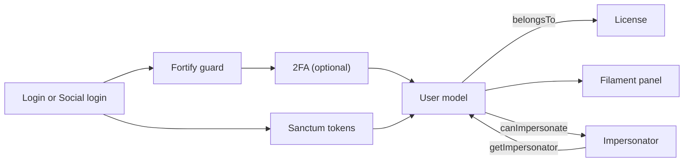
```mermaid
flowchart LR
  Login[Login or Social login]
  Fortify[Fortify guard]
  Sanctum[Sanctum tokens]
  TwoFA["2FA (optional)"]
  User[User model]
  License[License]
  Pano[Filament panel]
  Imp[Impersonator]

  Login --> Fortify
  Login --> Sanctum
  Fortify --> TwoFA
  TwoFA --> User
  Sanctum --> User
  User -->|belongsTo| License
  User --> Pano
  User -->|canImpersonate| Imp
  Imp -->|getImpersonator| User
```

### Authorization: roles, permissions and ACLs

Authorization is a two-layer stack. Layer 1 is **Spatie roles + permissions** (`Core\Models\Role` and `Core\Models\Permission`, the latter with `acls()` HasMany). Layer 2 is **row-level ACLs** (`Core\Models\ACL`) tied to a permission and carrying a `FiltersGroup` (JSON query-builder filters), plus an `unrestricted` flag and a `priority`. `AclResolverService::getEffectiveAcls()` resolves ACLs per role with parent-role inheritance (closure-table ancestors), super-admin bypass, OR-composition across non-hierarchical roles, and a 1-hour cache (`acl:resolved:user:{id}:perm:{id}`). `AuthorizationService` is the single entry point used by `CrudService` to enforce permissions and inject ACL filters into request data.

Beside that stack sits a per-row check: `HasValidations` verifies the table-level permission for
every hydrated row, named `{connection}.{table}.{operation}` with `default` standing in for the
default connection. A permission that is not registered reads as "operation allowed". The CRUD read
engine suppresses the check for the class it is hydrating, having already ensured the table-level
permission and injected the ACL filters. **Roles and permissions are exempt from it outright**:
they are the material an authorization answer is made of, so reading one cannot require an answer,
and `Core\Authorization\ResolvingAuthorization` marks the window in which an answer is being
worked out so nested reads inside it pass.

**SPA profile surface.** `GET /app/auth/user/profile-information` (`UserInfoResponse`) returns the session user's `permissions` (grouped by guard — a SPA builds its menu from these, no server-side menu), `groups`, `canImpersonate`, `lang`, plus `isFirstLogin` (onboarding flag) and `preferences` (the server-persisted UI-chrome bag). Self-service writes let a signed-in user update **their own** row without holding CRUD `update` on `users`: `PATCH /app/auth/user/preferences`, `DELETE /app/auth/user/preferences`, `DELETE /app/auth/user/preferences/{namespace}` and `PATCH /app/auth/user/first-login-complete` (clears `isFirstLogin`). The preferences bag is one JSON object whose top-level keys are namespaces (`^[a-z][a-z0-9_.-]{0,39}$`), one per client, so a client never overwrites another's. `PATCH` replaces each namespace it receives, removes one sent as `null` and leaves the rest, so two devices cannot erase each other; `DELETE` clears the whole bag or one namespace. `Modules\Core\Rules\PreferencesBag` holds the generic limits, in code and not in env: 64 KiB serialized, array depth 6 counting the bag itself, JSON-compatible values only; the 64 KiB is checked on the payload and again on the bag it merges into. A breach answers 422. Preferences are cosmetic and never read for authorization. All of them operate strictly on `Auth::user()` (no id accepted) and persist via `saveQuietly()`, deliberately bypassing the CRUD authorization/versioning events that gate admins editing other accounts; both echo the refreshed profile. Columns: `users.is_first_login` (bool, default true) and `users.preferences` (nullable json).

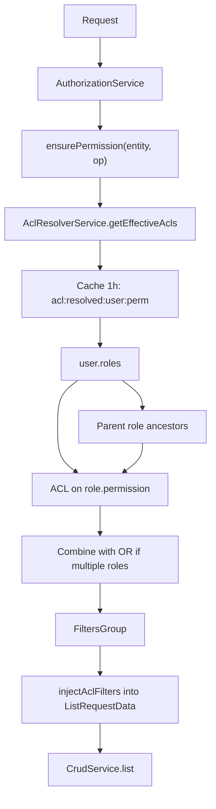
```mermaid
flowchart TB
  Req[Request]
  Auth[AuthorizationService]
  ChkPerm["ensurePermission(entity, op)"]
  Resolve["AclResolverService.getEffectiveAcls"]
  Cache["Cache 1h: acl:resolved:user:perm"]
  Roles[user.roles]
  Inherit[Parent role ancestors]
  Direct["ACL on role.permission"]
  Combine[Combine with OR if multiple roles]
  Filters[FiltersGroup]
  Inject[injectAclFilters into ListRequestData]
  Crud[CrudService.list]

  Req --> Auth --> ChkPerm
  ChkPerm --> Resolve
  Resolve --> Cache
  Cache --> Roles
  Roles --> Direct
  Roles --> Inherit
  Inherit --> Direct
  Direct --> Combine
  Combine --> Filters
  Filters --> Inject
  Inject --> Crud
```

### Record lifecycle traits stack

A Core model can compose any subset of: `SoftDeletes` (`deleted_at` + `is_deleted` runtime toggleable via `soft_deletes.enabled.{table}` setting), `HasVersions` (uses `Overtrue\LaravelVersionable` underneath, toggled by `versioning.strategy.{table}` in group `versioning` and supports DIFF or SNAPSHOT), `HasApprovals` (captures creates, updates, deletes, force deletes and restores as `Modification` requests, plus a `preview` flag), `HasValidity` (`valid_from`/`valid_to` columns plus scopes `valid()`, `expired()`, `scheduled()`, `draft()`; some models such as CMS `Content` also add a `valid` global scope in `booted()`), `HasLocks` (`locked_at`/`locked_user_id`/`locked_until`; `is_locked` is computed, not stored — see `RECORD_LOCKING_DEVELOPER.md`), and `HasOptimisticLocking` (`lock_version`). The state diagram below summarises how a row moves through these phases when traits are stacked together (e.g. as on `User` or CMS `Content`).

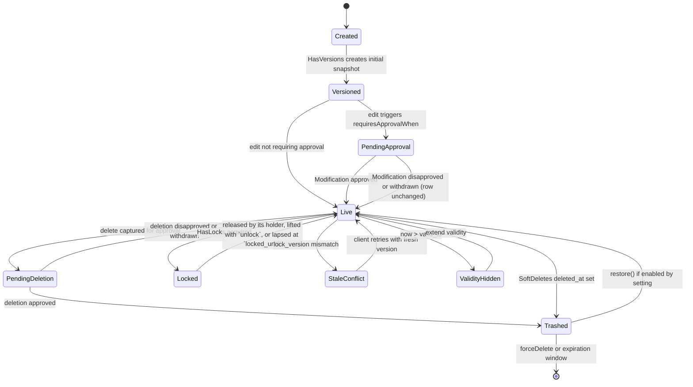
```mermaid
stateDiagram-v2
  [*] --> Created
  Created --> Versioned: HasVersions creates initial snapshot
  Versioned --> PendingApproval: edit triggers requiresApprovalWhen
  Versioned --> Live: edit not requiring approval
  PendingApproval --> Live: Modification approved
  PendingApproval --> Live: Modification disapproved or withdrawn (row unchanged)
  Live --> PendingDeletion: delete captured for approval
  PendingDeletion --> Trashed: deletion approved
  PendingDeletion --> Live: deletion disapproved or withdrawn
  Live --> Locked: HasLocks acquired
  Locked --> Live: released by its holder, lifted with `unlock`, or lapsed at `locked_until`
  Live --> StaleConflict: lock_version mismatch
  StaleConflict --> Live: client retries with fresh version
  Live --> Trashed: SoftDeletes deleted_at set
  Trashed --> Live: restore() if enabled by setting
  Trashed --> [*]: forceDelete or expiration window
  Live --> ValidityHidden: now > valid_to
  ValidityHidden --> Live: extend validity
```

### Versioning flow

`HasVersions` (extends `Overtrue\LaravelVersionable\Versionable`) controls whether a save creates a new version using `getVersionStrategy()`. The strategy is read with two-level caching: an L1 in-memory map per request and an L2 persistent cache fed by the `versioning.strategy.{table}` setting in group `versioning`. When versioning is enabled, the trait emits `ModelVersioningRequested` and dispatches `CreateVersionJob` (after-commit) so the `VersioningService` writes a `Core\Models\Version` row with `contents` (DIFF) or full snapshot (SNAPSHOT). Reverts use `Version::revertWithoutSaving()`, replaying previous versions for DIFF or applying the initial snapshot for SNAPSHOT; `revertToVersion()` wraps the reverting save in a `Revert`-kind version set whose `reverted_from_set_id` points at the restored set, so a rollback is append-only and never mistaken for an ordinary edit. `createSnapshotVersion()` plus `purgeOldVersionsAfterCreate` enables history compaction. Delete lifecycle is captured before the row disappears: a **hard delete** (`forceDelete()`, or any `delete()` on a model without `SoftDeletes`) writes a self-contained `Deleted` tombstone forced to `SNAPSHOT`, so the record stays reconstructable without a surviving diff chain; a **soft delete** is recorded as an `Updated` change on the `deleted_at` column (symmetric with the soft restore that clears it), so a `Deleted` history row always means the row physically ceased to exist. `trashingVersions()` returns the soft-delete (trashing) history rows.

`HasVersionedRelations` is the foundation of the aggregate membership vector: a model declares its versioned relations with `RelationOwnership` (`reference`/`owned`) via `versionedRelations()` (no automatic discovery). `attachVersioned()`/`detachVersioned()` perform the pivot mutation and write one membership version row per subject inside a version set — `versionable` = root, `relation_path` = the relation, `subject_key` = `{id}`, `contents` = pivot attributes, `change_type` = `Created` (link added) / `Deleted` (link removed), strategy `SNAPSHOT`. Attach is idempotent (`syncWithoutDetaching`), so a re-attach updates the pivot in place instead of duplicating. `syncVersioned()` replaces the whole membership with a target set as a single revision (all detaches and upserts join one version set). `versionedRelationMembership()` reconstructs current membership by replaying those events in revision order. `restoreToRevision($targetSet, $expectedSet, $force = false)` restores the scalars and every declared `reference` relation to a target revision as one reversible `Revert` version set (scalars reset via the version at-or-before the target, references re-linked to the membership as of the target without touching the shared subjects' own fields); it rejects the restore when the aggregate moved past `$expectedSet` (`currentRevision()`) and, unless `$force`, aborts when a referenced subject no longer exists (`RestoreReport` lists any skipped subjects). Owned children (`subject_version_id`), transparent `BelongsToMany` adapters, and shared-subject `uuid` are not yet implemented (see the milestone-1 plan).

If a concrete model declares its own `versionStrategy = VersionStrategy::DIFF`, that class property takes precedence and is not runtime-configurable. `ForcedVersionStrategySettings` discovers those models across active/inactive modules; `SettingResource`, tabs, filters, and form validation hide/reject matching historical `versioning.strategy.{table}` rows without deleting them.

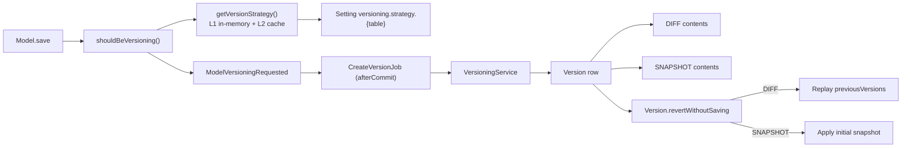
```mermaid
flowchart LR
  Save[Model.save]
  Should["shouldBeVersioning()"]
  Strat["getVersionStrategy()<br/>L1 in-memory + L2 cache"]
  Setting["Setting versioning.strategy.{table}"]
  Event[ModelVersioningRequested]
  Job["CreateVersionJob (afterCommit)"]
  Svc[VersioningService]
  Vers[Version row]
  DIFF[DIFF contents]
  SNAP[SNAPSHOT contents]
  Revert["Version.revertWithoutSaving"]
  Replay[Replay previousVersions]
  Apply[Apply initial snapshot]

  Save --> Should
  Should --> Strat
  Strat --> Setting
  Should --> Event --> Job --> Svc --> Vers
  Vers --> DIFF
  Vers --> SNAP
  Vers --> Revert
  Revert -->|DIFF| Replay
  Revert -->|SNAPSHOT| Apply
```

### Approvals and preview

`HasApprovals` (Core's own trait, derived from `cloudcake/laravel-approval`, see `LICENSES/laravel-approval.md`) intercepts every write its author may not apply alone and turns it into a `Modification` request instead of touching the row. It listens to `saving` (create, update), `deleting` (delete and force delete: Laravel's `forceDelete()` fires `deleting` too) and, on soft-deletable models, `restoring`. Each request records its `operation` (`Operation::Create|Update|Delete|ForceDelete|Restore`); creates and updates carry a diff, the other three carry none. Repeating a write never resets the quorum of the request it reuses, since moderation may have set it after capture. A delete, force delete or restore has at most one pending request per record: whoever repeats it joins that request, whose author stays the same. A create or update reuses only the author's own pending request with the same diff; another author saving the same diff gets a request of their own, so nobody takes over a request others have voted on.

**Who is captured.** Nothing in the console (seeders, queues, commands). Nothing a superadmin writes. A writer holding the table's `approve` permission writes directly when one approval is enough; with more approvals required, their write is captured and credited with one automatic approval (`meta.source = author_approve_permission`), applied at once when that completes the quorum. Everybody else is captured. Models narrow the rule: `requiresApprovalWhen(array $diff)` for saves (CMS `Content` only on validity changes; Core `Setting` on any field other than `description` and `group_name`), `requiresApprovalForOperation(Operation)` for deletes and restores (CMS `Content` deletes drafts and expired contents directly), and `approvalOperations()` for which operations are captured at all (CMS `Comment` captures only creates and updates: an author deletes their own comment).

**While a deletion waits.** `pendingDeletionStrategy()` decides: `Block` (default) keeps the record visible and refuses every save with `PendingDeletionLock`, except the attributes listed by `attributesWritableWhilePendingDeletion()` and `updated_at`; `Hide` filters the record out for authenticated users who hold neither `approve` nor `disapprove` on its table (global scope `PendingDeletionStrategy::HIDE_SCOPE`; local scope `withoutPendingDeletion()`). With nobody authenticated (console, queues, indexing, exports) nothing is hidden.

**Validation.** A write is validated with the model's rules before it is captured, since model validation otherwise runs on `creating`/`updating`, which a captured write never reaches: a pending request only ever holds data the model accepts.

**Deciding.** Votes go through `ModificationVoteService`, the only place a decision is applied. `cast()` records the vote and, when it completes the quorum, applies the decision in the same transaction: an approved create or update writes its diff, an approved delete, force delete or restore runs it, and an approved deletion rejects the record's pending updates (`reason = record deleted`). If applying fails, the vote is rolled back and the request stays pending. A decided request is deactivated and kept, with its votes, as the trail. The author never votes on their own request. A side is reached when its votes meet or exceed its quorum. `castWithQuorum()` sets the quorum and casts the vote in the same transaction, for callers that change the quorum (AI moderation): the new quorum counts the votes already cast, so lowering it applies whichever side it completes (the side just voted for wins when both are). Never change `approvers_required` or `disapprovers_required` with a plain save on a pending request: a quorum it completes would stay unapplied. For the same reason `Modification` implements `RestrictsCrudWrites` and denies every generic CRUD write: the panel and the API vote on modifications, they never edit them.

**Withdrawing.** `ModificationVoteService::withdraw()` lets the author, and only the author, drop a request before its decision: the request and its votes are deleted and the record stays as it was.

**Events.** After the transaction commits the service fires `ModificationApproved`, `ModificationRejected` or `ModificationWithdrawn` (see `EVENT_ORCHESTRATION.md`). `ModificationRequiresModeration` still fires when a request is created.

**Outcome on each surface.** `pendingModification()` on the instance returns the request its last write became, or `null` when the write ran; `wouldRequireApproval(Operation)` answers without writing. The Filament edit pages of approval models (trait `Filament\Utils\ReportsApprovalOutcome`) label delete, force delete and restore as requests when they would be captured, report "sent for approval" instead of a save or delete that did not happen, and explain a save refused by a pending deletion. Modifications is read-only apart from Approve and Disapprove (voters, never the author) and Withdraw (the author, while the request is active). The CRUD API answers `202` with `{modification, operation}` for a captured write, `409` for a save refused by a pending deletion, and exposes `PATCH /app/crud/withdraw/{module}/{entity}` (see `CRUD_SYSTEM.md`). AI CRUD tools answer `status: pending_approval` with the request id.

**Limit.** Only model events are intercepted: mass query updates and deletes (`Model::query()->update()`, `->delete()`) bypass approvals.

While `preview()` is true (request middleware + session), the trait appends a `preview` accessor that overlays pending modifications on top of stored attributes via `toArray()`.

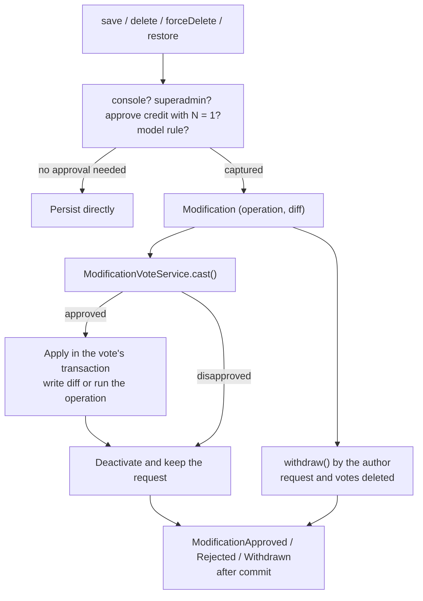
```mermaid
flowchart TB
  Write["save / delete / forceDelete / restore"]
  Gate["console? superadmin? approve credit with N = 1?<br/>model rule?"]
  ApplyDirect[Persist directly]
  Mod["Modification (operation, diff)"]
  Vote["ModificationVoteService.cast()"]
  Apply["Apply in the vote's transaction<br/>write diff or run the operation"]
  Keep["Deactivate and keep the request"]
  Withdraw["withdraw() by the author<br/>request and votes deleted"]
  Events["ModificationApproved / Rejected / Withdrawn<br/>after commit"]

  Write --> Gate
  Gate -->|no approval needed| ApplyDirect
  Gate -->|captured| Mod
  Mod --> Vote
  Vote -->|approved| Apply --> Keep
  Vote -->|disapproved| Keep
  Mod --> Withdraw
  Keep --> Events
  Withdraw --> Events
```

### Dynamic entities, presets and fields

The dynamic-entity stack lets modules describe domain objects without writing one table per type. `Core\Models\Entity` is **abstract**: each module subclass pins an `EntityType` enum (CMS uses `CONTENTS|CONTRIBUTORS|CATEGORIES`). `Core\Models\Preset` is also abstract and hosts `BelongsToMany Field` via the `fieldables` pivot (with `is_required`, `default`, `order_column`). When a preset's fields change, `Preset::createFieldsVersion()` (delegated to `PresetVersioningService`) writes a new `Presettable` row with a `fields_snapshot` and an incremented `version`. Each domain row carries `entity_id` + `presettable_id`, so schema changes do not break older rows: `Preset::migrateRelatedModelsToLastVersion()` reassigns related rows to the active presettable when ready.

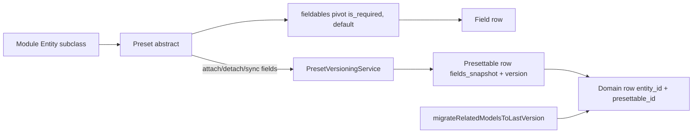
```mermaid
flowchart LR
  EntityT[Module Entity subclass]
  Preset[Preset abstract]
  Field[Field row]
  Fieldable[fieldables pivot is_required, default]
  PresetSvc[PresetVersioningService]
  Presettable[Presettable row fields_snapshot + version]
  Domain[Domain row entity_id + presettable_id]
  Migrate[migrateRelatedModelsToLastVersion]

  EntityT --> Preset
  Preset --> Fieldable --> Field
  Preset -->|attach/detach/sync fields| PresetSvc
  PresetSvc --> Presettable
  Presettable --> Domain
  Migrate --> Domain
```

### Schema inspector and DynamicEntity

`SchemaInspector` reads columns/indexes/foreign keys from the live DB and keeps a shared in-memory cache (plus persistent cache via Laravel cache for cross-request reuse). `DynamicEntityService` is a singleton that resolves a table name to either a concrete model (`User` for `users`) or to a `Core\Models\DynamicEntity` instance whose `inspect()` method populates `fillable`, `casts`, validation rules (`type`, `min:0`, `required`, `exists:`, `unique:`), primary key info, and HasMany / BelongsToMany dynamic relations from foreign keys + indexes. The CRUD layer reuses this metadata so adding a column to a table is reflected in routes/forms without re-deploying code. Cache invalidation is exposed via `clearAllCaches()` and the `inspector:warm` command.

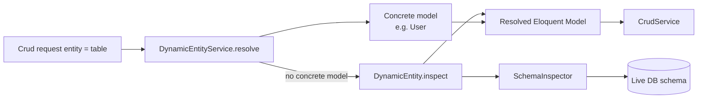
```mermaid
flowchart LR
  Req[Crud request entity = table]
  Svc[DynamicEntityService.resolve]
  Concrete[Concrete model<br/>e.g. User]
  Fallback[DynamicEntity.inspect]
  Inspector[SchemaInspector]
  DB[(Live DB schema)]
  Out[Resolved Eloquent Model]
  Crud[CrudService]

  Req --> Svc
  Svc --> Concrete
  Svc -->|no concrete model| Fallback
  Fallback --> Inspector --> DB
  Fallback --> Out
  Concrete --> Out
  Out --> Crud
```

### CRUD pipeline

`CrudService` is the unified entry for list/detail/history/tree/search/insert/update/delete. Each read operation runs in this order: (1) `AuthorizationService::ensurePermission()` (super-admin bypass + `hasPermissionTo`), (2) `AuthorizationService::injectAclFilters()` which merges the resolved `FiltersGroup` (AND with caller filters) into request data, (3) `QueryBuilder::prepareQuery()` builds the Eloquent query (filters/sort/relations/cursor), (4) execution either by pagination, range, or others, with optional `applyComputedMethods` and `applyGroupBy`, returning a `CrudResult` with `CrudMeta`. Write operations stack lock checks (`HasLocks`/`HasOptimisticLocking`) and approval routing (`HasApprovals`: a captured write answers `202`, a save refused by a pending deletion `409`).

**List counting modes.** A paginated list (`page`) defaults to **look-ahead**: it skips the `COUNT(*)`, over-fetches one row (`pagination + 1`), trims it, and returns `hasMore` — `totalRecords`/`totalPages` are omitted. Pass `totals=true` to opt into the **counted** mode, which computes the exact total and returns `totalRecords`/`totalPages`. Look-ahead is sort-agnostic (works for any ordering, unlike keyset cursors) and suits infinite-scroll / "load more" UIs; numbered-page UIs pass `totals=true`. `CrudMeta.mode` (`counted`|`lookahead`, surfaced as `meta.mode`) advertises which one applied, so the client renders the right footer without inferring it from field presence. A full `get` (no `page`/`from`/`limit`/`count`) still derives the total from the fetched rows without a `COUNT(*)`. Facet distribution counts (`facetCounts`) group real base-table columns in SQL and fall back to an in-memory count only for computed accessors.


**Write-restricted models.** A model that implements `Modules\Core\Contracts\RestrictsCrudWrites` (usually through the `DeniesGenericCrudWrites` trait) lists in `deniedCrudWrites()` the generic write operations it refuses: `insert`, `update`, `delete`, `forceDelete`, `restore`, `approve`, `disapprove`, `lock`, `unlock`. `CrudService` checks it before the permission check and throws `CrudWriteNotAllowedException`, which `CrudController` answers with `403`. Services and domain actions that write the model directly are not subject to it. ERP uses it on posted accounting rows (journal entries and lines, VAT register entries) and stock rows (movements, levels, cost layers).

**One permission for both votes.** Casting an approval or a disapproval needs the single `approve` permission on the table; `ActionEnum` declares no `disapprove` ability, so none is ever created. The author of a request never votes on it. AI moderation votes as the seeded system user (`permission.users.system`), which therefore needs `approve` on the moderated table.
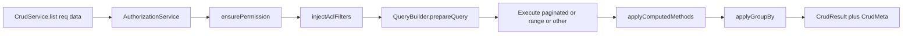
```mermaid
flowchart LR
  Req[CrudService.list req data]
  Auth[AuthorizationService]
  Ensure[ensurePermission]
  Inject[injectAclFilters]
  QB[QueryBuilder.prepareQuery]
  Exec[Execute paginated or range or other]
  Comp[applyComputedMethods]
  Group[applyGroupBy]
  Result[CrudResult plus CrudMeta]

  Req --> Auth
  Auth --> Ensure --> Inject --> QB --> Exec --> Comp --> Group --> Result
```

### Graph framework

Core Graph is a CRUD extension, not a CMS-only subsystem. Routes are mounted under `/crud/graph`: `expand/{module}/{entity}/{id}` extends detail, `search/{module}/{entity}` extends CRUD search, and `stats/{module}/{entity}/{id}` derives analytics from the same authorized expansion returned by `expand`. `ExpandGraphRequest` extends `DetailRequest`; `SearchGraphRequest` extends `SearchRequest` and keeps `qs`, `mode`, pagination, filters, sorts, and `limit` with their CRUD meanings. Graph adds only `relations[]`, `depth`, `relation_limit`, and `node_detail`.

Traversal is explicit. Requested `relations[]` are the only traversed paths; without explicit relations Core asks an optional provider for defaults, otherwise it returns only the center/search seed nodes. Authorization uses `AuthorizationService`: inaccessible centers fail like CRUD detail, while inaccessible neighbor nodes are omitted and reported through `graphMeta.filteredByAcl`. Cross-module nodes keep their own `{module}:{entity}:{id}` identity and their own CRUD permission checks.

Providers are optional. `GraphProviderInterface` supplies default relations, summary fields, edge labels, and exclusions. `GraphProviderRulesInterface` can narrow allowed paths, max depth, and per-relation limits. Runtime traversal remains the source of truth for `expand`, `search`, and `stats`; materialized edges were evaluated on 2026-09-30 and not built, since request cost tracks query count rather than graph size (see Performance Boundary in GRAPH_SYSTEM.md). Stable developer reference: [GRAPH_SYSTEM.md](../GRAPH_SYSTEM.md).

### Media API

Core exposes a generic media HTTP API for any media-enabled owner entity (any model that uses `Core\Helpers\HasMedia` and implements Spatie's `HasMedia` contract). Routes are session-authenticated and mounted inside the `/crud` web group. `GET /app/crud/media/{module}/{entity}/{id}` (`core.crud.media.list`) lists the record's media grouped by collection name, and `DELETE /app/crud/media/{module}/{entity}/{id}/{media}` (`core.crud.media.delete`) removes one media item by id or uuid after verifying it belongs to the record. Upload is a **single endpoint with an optional `{id}`** — `POST /app/crud/media/{module}/{entity}/{id?}` (`core.crud.media.upload`): with an `{id}` the uploaded `file` binds to that record's `collection` (validated against the model's registered collections; unknown collection → 422; optional `name`, optional `custom_properties[]`); **without an id** the file is staged in the caller's pending bucket (see below). The client never invents a token — the server mints one on the first id-less upload.

Authorization **reuses the owner entity's CRUD permissions** — no media-specific permissions exist: LIST requires the entity's `select`; a bound UPLOAD (with id) and DELETE require the entity's `update`; an id-less (pending) UPLOAD requires the entity's `insert`. Enforced through `AuthorizationService::ensurePermission()` against the owner model's table + connection (same check as the CRUD pipeline). An `AuthorizationException` maps to a 403 envelope for an authenticated user and a 401 envelope for the anonymous user, like sibling CRUD endpoints; an entity whose model is not media-enabled returns 404. `MediaResource` serializes `id`, `uuid`, `collection_name`, `name`, `file_name`, `mime_type`, `size`, `order_column`, `custom_properties`, `url`, a `conversions` map (generated conversion name → url) derived generically from the media's own generated conversions, and `draft_token` (the owning draft's token while the asset is still staged, else `null`).

The per-id endpoints resolve the owner record **through the caller's row-level ACL**: the controller captures the permission name returned by `ensurePermission()`, fetches `AuthorizationService::getAclFilters()`, and applies them (via `QueryBuilder::applyFilters()`) on top of a `whereKey({id})` query before `firstOrFail()`. A row hidden by ACL therefore surfaces as a 404 — a user with the entity permission but no ACL visibility of that row cannot list/upload/delete against it. Super-admin/unrestricted callers (`getAclFilters()` returns `null`) resolve the record as a plain lookup.

**Pending bucket + claim (CREATE forms).** During a create form the owner record has no id yet, so the id-less upload stages files in a token-keyed bucket (`Core\Models\MediaDraft`, table `core_media_drafts`, one media collection `pending`) that is later moved onto the freshly created record:

-   `POST /app/crud/media/{module}/{entity}` (the id-less form of `core.crud.media.upload`): auth = the entity's **`insert`** permission. Body: `file` (required), `collection` (required, validated against the *target* model's registered collections → 422 if unknown), `token` (optional uuid), optional `name`, optional `custom_properties[]`. With no `token` the server opens a fresh `MediaDraft` for `(auth user, module, entity)` and **mints a uuid token**; with a `token` it reuses that existing draft. The file is stored in the `pending` collection with the intended `target_collection` recorded as a custom property, and the response is a `MediaResource` with `201` whose `draft_token` carries the token for the client to reuse and later claim.
-   `GET /app/crud/media/pending/{module}/{entity}?token={uuid}` (`pending.list`): auth = `insert`. Returns the user's pending media grouped by the stored `target_collection` (fallback bucket `pending`) — same envelope shape as `list`.
-   `DELETE /app/crud/media/pending/{module}/{entity}/{media}?token={uuid}` (`pending.delete`): auth = `insert`. Deletes a single pending media that belongs to the user's draft for that token; `404` if not found.
-   `POST /app/crud/media/claim/{module}/{entity}/{id}` (`claim`): auth = the entity's **`update`** permission **plus the row-level ACL** on the target `{id}` record. Body: `token` (required uuid). Moves every pending media of the user's draft onto the real record (Spatie `move()`), targeting each media's stored `target_collection` (fallback `images`), then deletes the emptied draft and returns the moved media grouped by collection. A missing/foreign token moves nothing and returns empty `data` (not an error).

The literal-prefixed `pending`/`claim` routes are registered **before** the generic `{module}/{entity}/{id?}` routes so they win by registration order. Stale drafts (and their staged media) are pruned by the `core:prune-media-drafts` command, scheduled daily; the TTL is `config('core.media.draft_ttl_hours')` (env `CORE_MEDIA_DRAFT_TTL_HOURS`, default `24`).

### Media search

`Modules\Core\Models\Media` (Spatie media, table `core_media`) is `Searchable` and embeddable once claimed onto a real owner: a media still owned by a `MediaDraft` is never indexed. Its document carries facets (`mime`, `track`, `collection`, `keywords`, `description`) and its vector source is `searchable_embed_text`: the Core display fields in `custom_properties` (`description`, `keywords`) plus any text a module contributes.

- **Deterministic metadata.** On create, `MediaMetadataService` fills `custom_properties` from the file (EXIF/IPTC, getID3, PDF details) and stores `content_hash` (sha256 of the file), with a `_provenance` map so it only overwrites values it wrote itself.
- **Contributor seam.** `SearchableContributorRegistry` lets a module add fields, mapping and embeddable text to another module's searchable model without Core referencing it (the AI module contributes its media analysis this way).
- **Owner surrogate.** Every searchable owner implementing Spatie's `HasMedia` gets a `media_surrogate` text field: each media's `Media::ownerSurrogateText()`, i.e. description, keywords and the compact fields contributors add to the media document. Heavy tracks (transcripts, OCR) stay in the media's own vector.
- **Owner visibility.** A media hit is shown only to users who may see its owner. `CrudService` applies `IAuthorizesSearchRehydration` when it turns search hits back into models, and `Media` implements it by grouping hits by owner type and delegating to the `IOwnerAuthorizer` registered for that type in `OwnerAuthorizerRegistry` (CMS registers `Content`: valid and `select` ACL; SAO registers `Ticket`: `TicketQueryService::visible()`). An owner type without an authorizer falls back to the owner's own `select` ACL; one that cannot be evaluated is dropped. The Core setting `media.search_visibility` (`owner` default, `open` for an owner-agnostic gallery) turns this off. Engine totals are counted before rehydration, so a page can hold fewer media than its size when owners are hidden.
- **Lifecycle.** `MediaLifecycleObserver` reindexes the owner when a media is edited (the claim included), soft-deleted or restored; a force delete also drops the media's `ModelEmbedding` rows.
- **Vector reuse.** `core_model_embeddings` is indexed on `(content_hash, model_key)` so the embedding pipeline can reuse the vectors of an identical text instead of embedding it again.

### Media gallery and curation (Filament)

The backoffice exposes claimed media through Filament, gated by the same seeded `core.media.*` permissions as any other resource (no bespoke media policy; policies here are reserved for domain actions):

- **Gallery (`MediaResource`).** A read-only, filterable list (by `mime_type`, `collection_name`, owner `model_type`) of claimed media with a read-only View page; draft-staged media are excluded via `getEloquentQuery`. It offers no create and no edit — media are born from an owner's upload. This realizes the owner-agnostic view that the `media.search_visibility=open` mode anticipates.
- **Owner curation (`MediaRelationManager`).** A reusable relation manager on the `media` relationship, attached to owner resources (CMS `Content`, SAO `Ticket`) via `getRelations()`. An owner's editor curates the display fields (`description`, `alt_text`, `keywords`) inside `custom_properties`; `applyDisplayEdit()` merges them back preserving technical metadata, `content_hash` and other fields' provenance, and marks each edited field `human` so the AI layer never overwrites it. Gated by the owner resource's own edit access.
- **Resource-schema seam (`ResourceSchemaContributorRegistry`).** The UI twin of the searchable-contributor seam: a module contributes read-only infolist sections and record actions for a model without Core referencing it. The media View renders the contributed sections and its header shows the contributed actions (the AI module adds its analysis panel and a "Re-analyze" action this way).

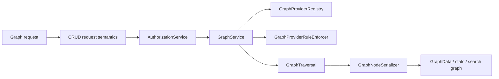
```mermaid
flowchart LR
  Req[Graph request]
  Crud[CRUD request semantics]
  Auth[AuthorizationService]
  Service[GraphService]
  Registry[GraphProviderRegistry]
  Rules[GraphProviderRuleEnforcer]
  Traversal[GraphTraversal]
  Serializer[GraphNodeSerializer]
  Response[GraphData / stats / search graph]

  Req --> Crud --> Auth --> Service
  Service --> Registry
  Service --> Rules
  Service --> Traversal --> Serializer --> Response
```

### Application content retrieval contract

Application content retrieval is a neutral Core extension boundary for read-only, AI-consumable evidence. It is separate from documentation RAG and Core Graph. `ApplicationContentRetrievalProviderInterface` exposes a typed source descriptor and a retrieval method; `ApplicationContentRetrievalProviderRegistryInterface` stores explicitly registered providers under deterministic normalized source keys. Duplicate sources fail during registration. Core does not discover providers through events, reflection, class names, or container scans, and it does not depend on the AI module.

`ApplicationContentRetrievalService` is the only production gateway. It requires the same authenticated, non-guest Core user in both the request resolver and the active guard, verifies that the provider module is enabled, enforces the source entity's `select` permission, resolves row ACL filters, calls the provider, and validates result invariants. `User::isGuest()` recognizes both an account whose name or username matches `permission.users.guest` and the legacy missing-email shape. Missing or inconsistent guest configuration fails classification; the gateway normalizes that failure and rejects the request before provider lookup. Unknown sources, identity disagreement, permission denial, provider failure, invalid locale, and malformed evidence all become the same generic unavailable failure.

The public DTO boundary is deliberately small:

- source descriptors contain module/entity identity, supported locales, bounded capabilities, and intent categories;
- queries contain only source, natural-language query, locale, and a bounded limit;
- authorization contains the server-resolved permission and optional `FiltersGroup` and never enters an AI payload;
- hits contain safe plain-text evidence, a user-facing label, a canonical `/app/...` reference, locale, strategy, revision, and truncation state.

Providers must apply ACL constraints before or during candidate lookup, rehydrate candidates through an authorized query, and project allowlisted fields. They must never return raw engine `_source`, Eloquent arrays, storage paths, permission names, ACL expressions, class names, table names, or connection/index identifiers. Events remain suitable for indexing, invalidation, deletion, and freshness notifications after explicit registration; they are not a provider injection mechanism.

### Translations and locale

`HasTranslations` keeps translatable fields in a sibling table (auto-resolved as `Models\Translations\{Model}Translation` and required to implement `ITranslated`). Setting a translatable attribute stores it under `pending_translations[locale][field]` until the model fires `saved`, at which point translations are upserted in batch. Reads consult: pending values, the loaded `translation` relation, then the loaded `translations` collection, then a targeted DB query — with optional fallback to default locale when `LocaleContext::isFallbackEnabled()` is true. A `LocaleScope` global scope eagerly loads the right `translation` per the active `LocaleContext`. After create/update of the default-locale translation the trait emits `TranslatedModelSaved`, which the AI module listens to in order to enqueue automatic translations for other locales.

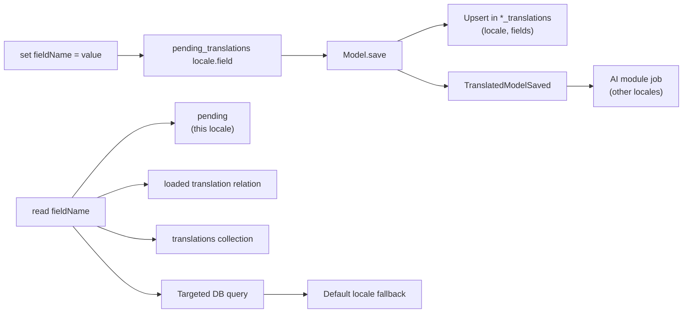
```mermaid
flowchart LR
  Set["set fieldName = value"]
  Pending[pending_translations locale.field]
  Save[Model.save]
  Persist["Upsert in *_translations<br/>(locale, fields)"]
  Get["read fieldName"]
  Pend2["pending<br/>(this locale)"]
  Rel[loaded translation relation]
  Coll[translations collection]
  Q[Targeted DB query]
  Fallback[Default locale fallback]
  Event[TranslatedModelSaved]
  AI["AI module job<br/>(other locales)"]

  Set --> Pending --> Save --> Persist
  Save --> Event --> AI
  Get --> Pend2
  Get --> Rel
  Get --> Coll
  Get --> Q
  Q --> Fallback
```

### Interface labels (lang files)

Interface labels live in PHP lang files registered on Laravel's default namespace, so the file name is the group. Generic, module-agnostic labels (actions, form, table columns, login, import, states) are in `Modules/Core/lang/{locale}/app.php` (`app.*`). Domain labels of a module (entities, fields, statuses, domain actions and messages) are in that module's own file, `Modules/{Module}/lang/{locale}/{module}.php` (`cms.*`, `mes.*`, `sao.*`, `erp.*`). Every locale file (en, it, de, es, sl) is standalone, with the same keys as the others: none merges another locale at load time. Missing keys fall back through Laravel's `fallback_locale`.

`GET /app/translations/{lang?}` (`TranslationCatalogService`) returns every group of every active module as dotted keys (`app.form.save`, `mes.entities.workCenters`). It merges all module lang directories of the same locale, then fills a non-default locale's missing keys from the default locale. The Vue UI loads this payload over its own Vue-only `ui.*` catalogs. A label goes in the backend when the backend could use it too (Filament, notifications, exports); Vue-only interaction copy stays in the UI catalogs.

### Search abstractions and engines

`Searchable` extends Elastic Scout Plus and adds: a `SchemaDefinition` driven by `FieldDefinition` + `IndexType` enums, a `SchemaManager` that synchronises engine schemas, and event-based indexing (`ModelRequiresIndexing` → `ReindexSearchJob` / `IndexInSearchJob` / `BulkIndexSearchJob` / `FinalizeReindexJob`) so listeners can pre-process embeddings or translations before the document is sent to the engine. `ISearchEngine` is bound to the active Scout engine (Typesense or Elasticsearch); database fallback is also provided. Optional AI overrides bind `IReranker`, `ISearchPlanner`, and `IQueryIntentParser` (Core ships heuristic fallbacks via `HeuristicReranker`, `FallbackSearchPlanner`, `SimpleQueryIntentParser`).


**An unreachable search engine.** Indexing is a side effect of a domain write, so on the synchronous path `Searchable` tolerates an unreachable engine (`SearchEngineAvailability::isUnreachable()`: transport failures such as `NoNodeAvailableException`): the write succeeds, a `Search engine unreachable, skipped …` warning is logged and the document is not indexed. Nothing reindexes it by itself: run `scout:reindex` or `scout:queue-import` once the engine is back. A queued search job is not a domain write, it exists only to reach the engine, so every `CommonSearchJob` runs under `FailWhenSearchEngineUnreachable`, a strict scope (`SearchEngineAvailability::strictly()`) in which the same condition fails the job: it is retried with the `scout.queue` backoff and, once the attempts are spent, lands among the failed jobs (Horizon, `failed_jobs`). Other failures (schema, payload, authentication) always propagate. Whatever indexes in place, outside a queued job (a synchronous import or flush), still only logs the warning, so check the log or the index count after such a run.
For durable cross-system integration, `OutboxRecorder` writes `core_outbox_events` in the same transaction as the domain operation and schedules `PublishOutboxEventJob` after commit. Delivery uses the replaceable `OutboxPublisher`; the default stub performs no external I/O. Event UUIDs are the consumer idempotency keys.

For operator-triggered bulk imports, Core provides `AbstractImportCommand`, `BulkImporterInterface`, optional `ConnectionAwareBulkImporterInterface`, module-injected resolver/discovery contracts, `ContainerBulkImporterResolver`, `FilesystemImportPluginDiscovery`, and `BulkImportRunner`. Core intentionally registers no `core:import`: concrete modules expose destination-specific commands and marker interfaces. Shared options are inherited through `getOptions()` (`--importer`, `--bootstrap`, repeatable `--arg`, `--dry-run`, `--limit`, `--no-search`, `--index-batch`). The import runs inside `Search\DeferredSearchIndexing::run()`: `searchable()` calls record keys instead of indexing, and the records are indexed through the bulk path (batched embeddings, adaptive engine writes) every `--index-batch` distinct records (default `scout.chunk.searchable`) and at the end, queued as `IndexDeferredSearchChunkJob` chunks when `scout.queue` is on and the queue is not `sync`, in place otherwise, with one output line per chunk; `--no-search` and dry-run drop them, so nothing is indexed or embedded. Dry-run rolls back only the importer-declared connection, or the default connection when none is declared; importers must suppress files, queues, HTTP calls, other connections, and other non-transactional side effects. Continuous synchronization remains a separate design requiring cursors, identities, conflicts, retries, and scheduling.

Advanced search filters are engine-owned before pagination. Scalar filters are allowed only on schema-declared filterable/facetable fields when a searchable schema exists. Indexed relation-field filters use dot paths such as `tags.id`, but only when the searchable schema declares the parent field and marks the nested property filterable/facetable. Elasticsearch receives nested queries, Typesense receives nested-field dot notation, and database search translates the same request to `whereHas` / `whereDoesntHave` through the schema field option `relation`. For relation fields, `!=` and `not in` mean anti-exists: no related indexed row may match the value/list.

Portable text matching is represented by granular `TextMatchOptions`; named profiles are presets rather than engine-level types. Elasticsearch and Typesense translate typo tolerance, prefix matching, term-length thresholds, and exact-match preference into native parameters. `ISearchEngine::textMatchCapabilities()` publishes native and degraded behavior. Database search always has a case-insensitive prefix or substring fallback. PostgreSQL can opt into `pg_trgm` `strict_word_similarity()` with `SEARCH_DATABASE_PG_TRGM_ENABLED=true`. Oracle remains on the portable fallback because `UTL_MATCH` is not suitable for generic indexed retrieval over long text; Oracle Text requires a future schema-aware adapter with explicit `CONTEXT` indexes.

Retrieval orchestration itself (how many strategies run, the fusion formula, reranking, response metadata, and which configuration keys are actually consumed) is documented in [SEARCH_RETRIEVAL_PIPELINE.md](./SEARCH_RETRIEVAL_PIPELINE.md). In short: the planner runs either keyword only or keyword + vector + hybrid (never two), sequentially; fusion combines min-max normalized per-strategy scores, an RRF rank term and an agreement bonus; the reranker then reorders the fused top-K and degrades to the fused order on failure. Vector retrieval needs both `core.search.vector.enabled` = true and the AI module, which owns the only `ITextEmbedder` binding.

Adaptive query matching analyzes individual tokens before engine translation. Short names remain exact-first with limited typo tolerance; acronyms, codes, UUIDs, emails, numbers, and short tokens are protected. Two meaningful words use strict token coverage, while longer natural-language queries lower the required token percentage. Public `qs` syntax also supports mandatory exact phrases with quotes and mandatory position-independent terms with `+`; both remain non-fuzzy. Optional request preferences, syntax, and granular overrides are documented in [SEARCH_MATCHING_USER.md](./SEARCH_MATCHING_USER.md); internal parsing, resolution, engine mapping, PostgreSQL prerequisites, and Oracle constraints are documented in [SEARCH_MATCHING_DEVELOPER.md](./SEARCH_MATCHING_DEVELOPER.md).

**Event orchestration (indexing + moderation):** Core emits `ModelRequiresIndexing` and `ModificationRequiresModeration`; the AI module registers optional pre-processing (embeddings, translation, `ai_approval`); Core finalize/fallback listeners complete indexing or leave moderation to humans. Per-model toggles: `translations.auto.{table}` via `PerModelSettingResolver`; AI moderation per entity is the AI module's `ai.features.moderation.entities.{table}`, offered for models with a registered `ModerationAdapter`. Full RAG-oriented flow: [EVENT_ORCHESTRATION.md](./EVENT_ORCHESTRATION.md) in this folder; extended diagrams: `Modules/Core/docs/EVENT_ORCHESTRATION.md`.

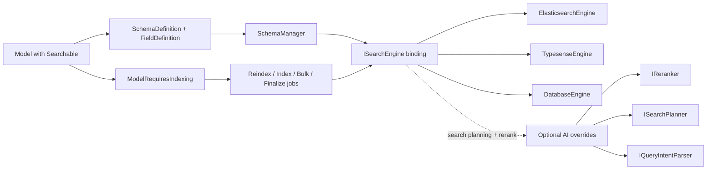
```mermaid
flowchart LR
  Model[Model with Searchable]
  Schema[SchemaDefinition + FieldDefinition]
  Manager[SchemaManager]
  Event[ModelRequiresIndexing]
  Jobs[Reindex / Index / Bulk / Finalize jobs]
  Engine[ISearchEngine binding]
  ES[ElasticsearchEngine]
  TS[TypesenseEngine]
  DB[DatabaseEngine]
  AIBind[Optional AI overrides]
  Rerank[IReranker]
  Planner[ISearchPlanner]
  Intent[IQueryIntentParser]

  Model --> Schema --> Manager --> Engine
  Model --> Event --> Jobs --> Engine
  Engine --> ES
  Engine --> TS
  Engine --> DB
  AIBind --> Rerank
  AIBind --> Planner
  AIBind --> Intent
  Engine -.->|search planning + rerank| AIBind
```

### Place and geocoding

`Core\Models\Place` is the canonical postal/geographic row shared across modules (CMS `Location.place_id`, ERP `Site.place_id`). It uses `HasSpatial` for a `geolocation` Point and exposes `searchDocumentGeographyFields()` so consumers can flatten the same shape into search documents. `Place::saving` keeps decimal `latitude`/`longitude` and the binary `geolocation` Point in sync; `geolocation` is excluded from version snapshots (binary WKB breaks JSON encoding on `Version`). Geocoding is delegated to `IGeocodingService` (Core), with concrete providers (`NominatimService` and `GoogleMapsService`) selected by config.

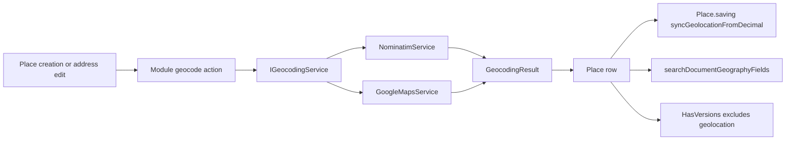
```mermaid
flowchart LR
  Caller[Place creation or address edit]
  Action[Module geocode action]
  Iface[IGeocodingService]
  Nominatim[NominatimService]
  Google[GoogleMapsService]
  Result[GeocodingResult]
  PlaceM[Place row]
  Sync[Place.saving syncGeolocationFromDecimal]
  SearchDoc[searchDocumentGeographyFields]
  Versioning[HasVersions excludes geolocation]

  Caller --> Action --> Iface
  Iface --> Nominatim
  Iface --> Google
  Nominatim --> Result
  Google --> Result
  Result --> PlaceM
  PlaceM --> Sync
  PlaceM --> SearchDoc
  PlaceM --> Versioning
```

### Settings and module activation

Runtime configuration lives in `Setting` (`Core\Models\Setting` with `HasApprovals` + `HasCache`). A setting name never carries its module: the declaring module is stored in the `module` column (filterable in the panel), and `DatabaseConfigOverlay` copies each row into the runtime config as `{module}.{name}`, so module `Core` + `auth.two_factor.enabled` is read with `config('core.auth.two_factor.enabled')`. Names start with their domain so related rows sort together, and the group is usually that first segment (`auth`, `locking`, `notifications`, `search`, `soft_deletes`, `translations`, `versioning`, `modules`); the `crud.*` settings sit in the `core` group. Per-model settings are `{domain}.{capability}.{table}` (`soft_deletes.enabled.cms_contents`, `versioning.strategy.users`, `locking.optimistic.sao_tickets`, `translations.auto.cms_contents`, `notifications.threshold.cms_comments`) through `PerModelSettingResolver::nameFor()` and the seeder prefix constants. Keys backed by a setting have no config or env default: seeders declare the conservative default. Three setting groups drive behaviour: `soft_deletes` (toggles `SoftDeletes` per table via `soft_deletes.enabled.{table}`), `versioning` (`versioning.strategy.{table}`), and `core` (the `active_modules` JSON array consumed by `ModuleDatabaseActivator`). The activator implements the Nwidart `ActivatorInterface` and reads/writes `active_modules` straight via `DB::table('settings')` (so it works during boot when Eloquent isn't ready), with optional cache. Editing `Setting` triggers `SettingObserver` and Approval flows on any field other than `description` and `group_name`. In the Filament panel settings cannot be created or deleted (seeders own them; `SettingResource` denies create, delete and force delete): the edit form keeps `name`, `type` and `encrypted` read-only, lets `group_name` pick an existing group or take a new one, and renders `value` with an input matching `type` and `choices`. The model validates `value` against the same two on every save and in the CRUD API (rule `Rules\SettingValue`): boolean, integer, numeric (`float`), date, string, and for `json` any shape; with `choices`, a string must be one of them and a json value one of them or a list of them, except the value already saved: a refresh that rewrites the choices keeps it, and `Setting::isValueOutsideChoices()` flags it. A partial API update that sends neither `type` nor `choices` is checked against the stored setting. `null` is always accepted. The `encrypted` flag does not encrypt the stored value: besides the panel column and filter, its only effect is that `SettingActionRunner` refuses to pass the value to a setting action command. The `is_internal` flag marks settings shipped by a first-party module seeder: it defaults to `false`, and `Seeder::internalSettingsDefinition()` stamps it as a structural column from the declaring module's ownership, `is_laraplate_owned_module($module)` (`module.json` `laraplate_owned`, or a `swolley/laraplate-*` composer name) — `true` for the native modules, `false` for a third-party module shipping settings through the same definition. Being structural, every reseed realigns it, ownership changes included. `group_name` is written only when the row is created: operators regroup settings freely and reseeds keep their choice. The panel shows it read-only in the form, as a hidden-by-default check column and as a filter. The `is_public` flag (default `false`) is operator-editable in the form, shown as a visible check column and a filter, and is not touched by seeders. `CoreDatabaseSeeder` seeds a `guest`-scoped ACL on `settings.select` filtering `is_public = true`, so guests read only public settings while staff roles stay unrestricted.

Settings are cached **per group**, not as one blob. `PerModelSettingResolver` stores each
`group_name` under its own key and keeps a lightweight `name => group_name` index so the read API
stays name-based. `SettingsCacheCoordinator` exposes `flushGroup()`, `flushGroups()` and
`registerGroupInvalidator()` alongside the wholesale `flushAll()`, and `SettingObserver` calls
`flushSetting()` on save and delete. So an ordinary edit invalidates the one group it touched, and
saving a row also syncs runtime config. Reach for `flushAll()` only when a change genuinely crosses
every group.

The Settings UI exposes only genuinely configurable rows. Class-forced DIFF strategies are intentionally absent even if stale rows remain in the database.

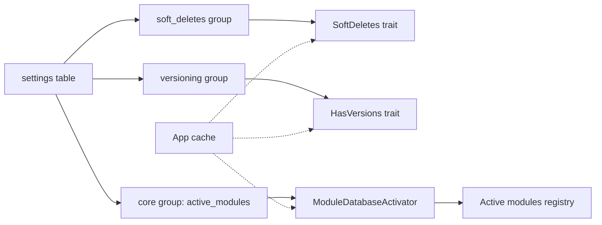
```mermaid
flowchart LR
  SettingsTable["settings table"]
  SoftG[soft_deletes group]
  VerG[versioning group]
  ModG[core group: active_modules]
  Cache[App cache]
  SoftTrait[SoftDeletes trait]
  VerTrait[HasVersions trait]
  Activator[ModuleDatabaseActivator]
  ModulesEnabled[Active modules registry]

  SettingsTable --> SoftG
  SettingsTable --> VerG
  SettingsTable --> ModG
  SoftG --> SoftTrait
  VerG --> VerTrait
  ModG --> Activator
  Activator --> ModulesEnabled
  Cache -.-> SoftTrait
  Cache -.-> VerTrait
  Cache -.-> Activator
```

### Database connection affinity

The native modules (`Core`, `CMS`, `AI`, `ERP`, `MES`, `SAO`) share one schema on one connection: cross-module foreign keys, `whereHas` and joins are allowed, and no module can be moved to a database of its own (decided 2026-09-04, rationale in `docs/database-connection-affinity-audit.md`). Several connections exist only at driver level, such as read replicas with `sticky`. `core.model_connections` and `erp.model_connections` are frozen with no entries, and new code must not use `ConnectionScoped*` or `ErpConnectionContext`.

Code still derives every query and transaction from the model that owns the data, never from the implicit `DB::` default: `$model->getConnection()->transaction(...)`, `$model->newQuery()`, the parent model's connection for its pivot and translation tables. `Modules/Core/tests/Unit/Architecture/DatabaseConnectionAffinityTest.php` scans the application code (not the tests) and fails on implicit default-connection calls; its baseline is empty. Services that write through a model (closure tables, ACL resolution, CRUD, preset versioning) have tests proving they follow a model moved to a secondary connection. Tests may still use `DB::` directly: under a single connection they are default-connection tests on purpose.

## Built-in abstractions used by other modules

Core exposes reusable primitives for module authors:

- UI/resource helpers (`HasTable`, `HasRecords`, `HasSlug`, `HasPath`, `HasActivation`, `SortableTrait`).
- Data lifecycle traits (`HasVersions`, `SoftDeletes`, `HasLocks`, `HasOptimisticLocking`, `HasApprovals`, `HasValidity`).
- Translation primitives (`HasTranslations`, `HasTranslatedDynamicContents`, `LocaleContext`, `LocaleScope`).
- Dynamic-entity primitives (`Entity`, `Preset`, `Presettable`, `Field`, `DynamicEntity`).
- CRUD request DTOs and `CrudService`/`AuthorizationService`/`AclResolverService`.
- Searchable trait + `SchemaDefinition` + `ISearchEngine`/`IReranker`/`ISearchPlanner`/`IQueryIntentParser`.
- Graph providers and traversal services (`GraphService`, `GraphTraversal`, `GraphProviderInterface`, `GraphProviderRulesInterface`).
- Geocoding contracts and providers (`IGeocodingService`, `NominatimService`, `GoogleMapsService`).
- Tabular exporters (`TabularCsvExporter`, `TabularPdfExporter`) — serialize an explicit `{key, label, format?}` column spec plus a row iterable to CSV or a minimal self-contained PDF, sharing one column contract. `TabularPdfExporter`'s PDF plumbing is `protected` so a module exporter with a custom row layout can extend it instead of duplicating the byte-offset bookkeeping (ERP's `ReportPdfExporter` does this).
- Settings infrastructure and module activation.

When building new module features, reuse these primitives instead of re-implementing lifecycle logic.

## Core command catalog (developer operations)

### Identity, permissions, approvals

- `auth:create-user`
- `permission:refresh`
- `approvals:check-pending`

### Licenses

- `auth:licenses`
- `auth:free-all-licenses`
- `auth:free-expired-licenses`

### Locking and concurrency

- `model:lock-refresh`
- `model:lock-sweep {--limit=1000}`
- `module:locked-add {model} {--namespace=}` / `model:locked-remove {model} {--namespace=}`
- `model:optimistic-lock-add {model} {--namespace=}` / `model:optimistic-lock-remove {model} {--namespace=}`

### Soft delete lifecycle

- `model:clear-expired`
- `model:soft-deletes-add`
- `model:soft-deletes-remove`
- `model:soft-deletes-refresh`

### Translation and translatable conversion

- `make:model-translatable`
- `make:translation`
- `lang:check-translations`

### Dynamic entities

- `model:create-entity {entity?} {--module=} {--content-model}`: creates an entity and its default `standard` preset, with the chosen fields, in a module that defines its own `Entity` model (CMS, ERP). The module comes from `--module`, or is the only one installed, or is chosen at the prompt; Core names no module, and the preset model is the module's own, resolved by `Entity::presets()`.

### Inspector and dynamic schema cache

- `inspector:warm`
- entity cache clear via CRUD route (`cache-clear/{entity}`)

### API docs

- Swagger generation command (module-specific command wiring in Core console)

### Filament scaffolding

- `filament:make-resources {module?}` — scaffolds Filament resources for Eloquent models in `App` (default) or a **custom** module. Official Laraplate modules (`laraplate_owned` in `module.json`, or composer `swolley/laraplate-*` fallback) are rejected. Pivot / MorphPivot models are skipped. Existing resource files: interactive overwrite prompt; under `--no-interaction`, skip and continue the batch. Always passes Filament `--generate` so form schemas and table domain columns come from DB inspect; table stubs pass generated columns into `HasTable`’s `$columns` callback while stripping trait-owned grezzi (`created_at`/`updated_at`/`deleted_at`, `valid_from`/`valid_to`) at generate + runtime. Generated table / form / list-page classes inject Core (or module-local) `HasTable` / `HasForm` / `HasRecords`, and generated create / edit pages inject `HasCloseOrCancelFormAction`, via permanent ClassGenerator container rebinds. App resources are discovered by `AdminPanelProvider` under `app/Filament/{Resources,Pages}`.
- `HasForm::configureForm($schema)` — call as `return self::configureForm($schema->components([...]));`. For models implementing `IDynamicContentModel` (the ones that use `HasDynamicContents`), prepends Entity → Preset selects (`dehydrated(false)`) and a required hidden `presettable_id` resolved from `Preset::activePresettable()`. Domain forms must not submit `entity_id` as the save key; `entity_id` is synced when `presettable_id` is set.

## How to use Core capabilities correctly

### For product/admin teams

- Every Filament list built on `HasTable::configureTable()` carries two toolbar buttons: **Reload** re-queries the rows keeping page, sort and filters; **Clear all filters** removes every removable filter plus the global and per-column searches, and overwrites the filters persisted in session. Relation managers that build their table without `configureTable()` do not get them.
- Create and edit pages stay on the record after saving (Filament's default). Their grey form button is the way out: it reads **Close** while the form matches what was last loaded or saved, and **Cancel** once something is unsaved, flipping back to **Close** after a save. The check is the one behind the panel's unsaved-changes alert, so it needs `unsavedChangesAlerts()` on the panel; without it the button keeps Filament's plain "Cancel". Every create/edit page carries `HasCloseOrCancelFormAction`; `tests/Feature/Filament/ResourceFormPagesCloseOrCancelTest.php` fails for a page that forgets it.
- Manage users/roles/ACL/settings in Filament resources. The ACL form edits `filters` as JSON in a code editor (the nested `FiltersGroup` shape, validated by `Rules\QueryBuilder` before save) and `sort` as a repeater of property/direction rows; the list orders by `priority` descending.
- Use approval queues and preview when moderation is enabled.
- Keep module activation and runtime settings under change-control.
- Super-admins see a Filament topbar environment badge; click it for App + installed module Composer versions (disabled modules appear muted). A Debug Mode badge appears when production runs with debug enabled.

### For API/front-end teams

- Use `/crud` with permission-aware query behavior.
- Use `/crud/graph/expand`, `/crud/graph/search`, and `/crud/graph/stats` when clients need graph-shaped entity data; request relations explicitly unless a module provider defines defaults.
- Handle lock/version conflicts explicitly in UX (retry/reload patterns).
- Consume Swagger docs generated by Core as source of API contract.

### For module developers

- Prefer Core lifecycle traits over custom ad-hoc implementations.
- Use settings groups for runtime switches when behavior must be configurable per table/module.
- Reuse inspector-driven metadata and avoid hardcoded schema assumptions.

## Locking

Full treatment in `RECORD_LOCKING_USER.md` and `RECORD_LOCKING_DEVELOPER.md`. In short: a lock carries
two axes, an owner (`locked_user_id`) and a deadline (`locked_until`). An owned lock is a **lease**
when it expires and a **hold** when it does not; an ownerless one is a **freeze**, meaning nobody may
write. Expiry is evaluated on read, so a lapsed lock is free at once and `model:lock-sweep` is only
housekeeping. Leases are taken by opening an edit form and cost no permission beyond `update`; holds
and freezes need `lock`, and releasing somebody else's lock needs `unlock`, deliberately a separate
permission.

The guard (`LockedModelSubscriber`) is on by default and refuses writes from anybody but the holder.
It has no acting user outside a request, so queues and console commands cannot write to a leased
record unless they say so with `Locked::withoutGuard()`. A model whose lock was never meant to cover
everything states that instead through `attributesWritableWhileLocked()`, empty by default: a write
confined to the attributes it lists goes through for any caller, one that strays outside them does
not.

The platform already supports runtime toggles for soft deletes and versioning per table. A similar
runtime toggle for locking (`locking_{table}`) is under evaluation to provide parity, with strict
safeguards to avoid accidental concurrency regressions.

## Troubleshooting quick guide

- Permission mismatch despite role assignment: refresh permissions and verify ACL chain/inheritance.
- Unexpected missing records: check soft-delete scopes and preview mode.
- Revert/rollback confusion: verify version strategy (`DIFF` vs `SNAPSHOT`) for the table.
- Concurrent update failures: inspect lock status and `lock_version` mismatch path.
- Dynamic entity metadata stale: warm or clear inspector caches.
- API docs outdated: regenerate Swagger/OpenAPI and verify version merge outputs.
- Translation fallback not kicking in: check `LocaleContext::isFallbackEnabled()` and confirm the default-locale translation row exists.

## Releases

This module is released from the application, not from its own repository: it carries no release scripts and no `cliff.toml`. From the `laraplate` root, `scripts/version.sh` bumps the `version` field of `Modules/Core/composer.json`, regenerates `Modules/Core/CHANGELOG.md` with the application's `cliff.toml`, commits `chore(release): vX.Y.Z` in the module repository, tags it and pushes both.

```bash
composer run version:dry Core      # print the plan, write nothing
composer run version:minor Core    # release with a forced level (also version:major, version:patch)
composer run version:all             # every module with pending commits, then the application
```

Without a forced level, git-cliff infers it from the conventional commits since the module's last tag. `CHANGELOG.md` lists released versions only. Releasing the module alone does not touch the application; `version:all` records the module in the application with a commit typed after the module's release level. Full reference: `docs/releasing.md` in the application.

## FAQ prompts for RAG

- How do ACL filters merge when a user has multiple roles?
- What is the difference between record lock and optimistic lock in Core?
- How do I rollback a record to a previous version?
- How can I disable soft deletes for one specific table at runtime?
- How are pending approvals previewed before final approval?
- How does module activation through settings work?
- How do I regenerate and publish Swagger docs after route changes?
- How do license checks affect login for normal users versus superadmins?
- How do I create a temporary user account with `valid_from` / `valid_to` on `users`?
- What is the difference between `User::isExpired()`, `isScheduled()`, and `isDraft()`?
- Should login providers check `User::isValid()` for time-boxed accounts?
- How do I convert an existing model to translation-table architecture?
- What should I clear when dynamic entity metadata looks outdated?
- When is `Presettable.fields_snapshot` updated and how do related rows migrate?
- How do `IReranker` / `ISearchPlanner` / `IQueryIntentParser` interact with the AI module?
- Why does `Place` exclude `geolocation` from version snapshots?
